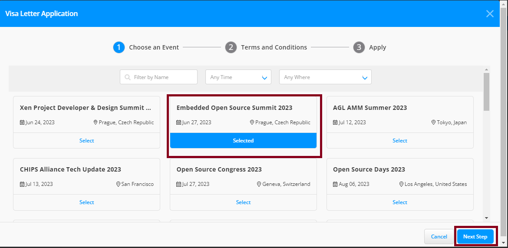
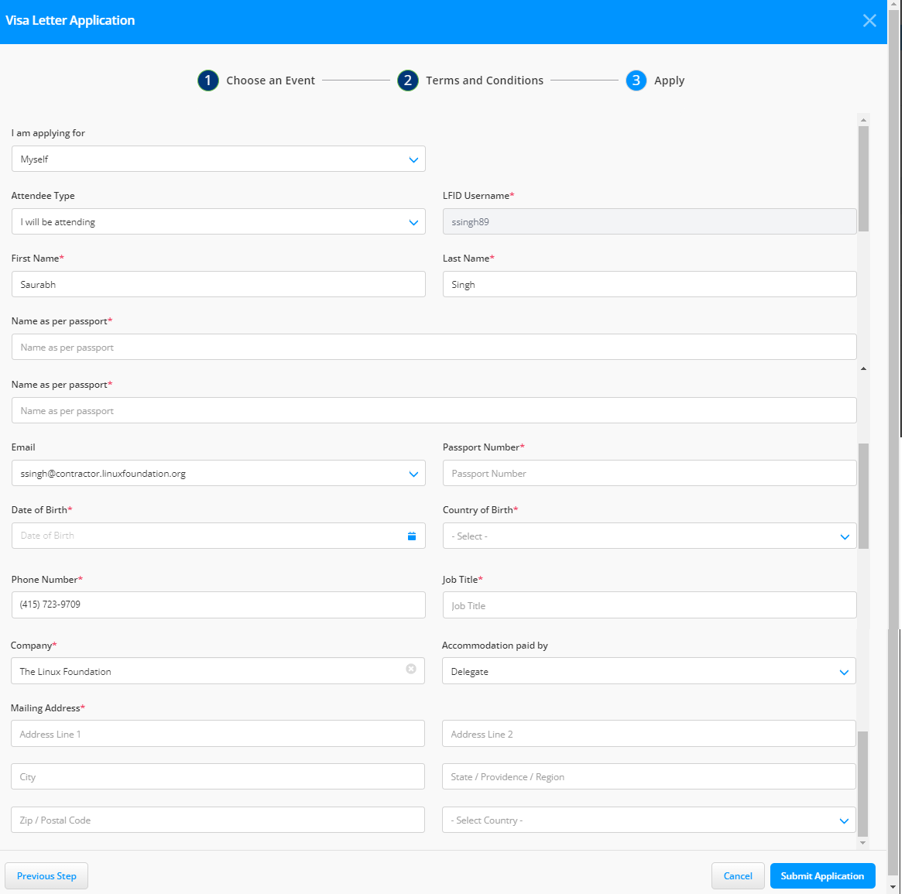
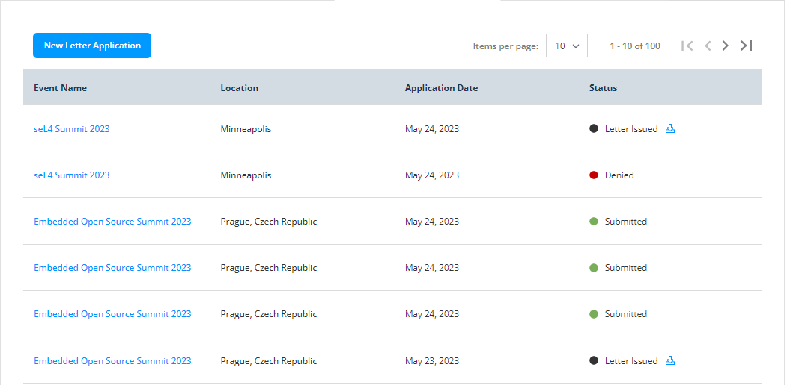

# Visa Letters

Visa letters are needed for events with international participants. They provide official documentation to support visa applications, helping attendees obtain travel documentation to enter the host country.

Providing visa letters helps expedite the visa application procedure and ensures that event attendees receive the required travel documents to enter the host country.


You can raise a visa letter request only if you have registered for an event.


To apply for the new visa letter, follow these steps:

1. Navigate to the **Individual Dashboard** login page. Type your login credentials and sign in. For more information, see the\
   [Sign in to Your Account](https://docs.linuxfoundation.org/lfx/sso/sign-in) page. If your login credentials are correct, you will be directed to the main dashboard or home page of the web UI.
2. From the left-side navigation pane, navigate to **EVENTS>LF Events**.
3. On the MY EVENTS page, click the **Visa Letters** tab. Click the **New Letter Application** CTA to access the application page.

<figure><figcaption>
New Letter Application
</figcaption></figure>

4. On the **Visa Letter Application** page, scroll down and check the events that you have registered. Click **Select** to choose the event. After selecting the event, click **Next**.

<figure><figcaption>
Select an event
</figcaption></figure>


If you have not registered for an event, then you must register for the event first. Click **Navigate to LF Events** CTA.


<figure><figcaption>
Pop-up window
</figcaption></figure>

5. On the **Terms and Conditions** page, read the terms and conditions for the visa application and click **Next Step**.

Apply for someone else

You select this option when you apply for someone else who has registered for the event. For example, you are applying for your CEO.

1. Click on **Apply for someone else,** CTA.&#x20;
2. On the next page, fill in all the required details of the person to whom you are applying.&#x20;
3. Click **Submit Application**.

**Note:** The Email address you use here must be the same one that is used in event registration. If it is not same then the request will fail.

* Click the **Cancel** button if you want to cancel your new visa application.
* Click the **Previous Step** button to go back to the event selection page.
* For questions, contact [visaletters@linuxfoundation.org](mailto:visaletters@linuxfoundation.org).

6. On the **Apply** page, fill out the following information to complete the application:

* **I am applying for:** From the drop-down, select if you are applying for yourself or someone else.
* **Attendee Type:** Select whether you are attending the event or are invited as a speaker.
* **LFID Username:** Enter your LFID if you are applying for yourself.
* **First and Last Name:** Enter your name if you are applying for yourself; otherwise, enter the name for whom you are applying.
* **Name as per passport:** Enter your name the same as the passport. (Many countries do not have first and last names on passports).
* **Email Address:** Enter your email address if you are applying for yourself; otherwise, enter the email address for whom you are applying.
* **Passport Number:** Enter the passport number.
* **Date of Birth:** Enter your date of birth or the person's date of birth for whom you are applying.
* **Country of Birth:** Enter your country or the person's country of birth for whom you are applying.
* **Phone Number, Job Title, and Company:** Enter the mandatory details.
* **Accommodation paid by:** Select the accommodation paid from the drop-down.
* **Mailing Address:** Enter your mailing address for future communication.

7. Click the **Submit Application** button.


Check and verify your details before submitting the request, once you submit the request you cannot change your details.



<figure><figcaption>
Submit Application
</figcaption></figure>

8. After you submit your application, the event team reviews your visa letter application.
9. You can see your application status on the **Visa Letters** page.
10. Once your request is approved by the events team, your application status is changed to '**Approved**'.
11. Click the download icon next to the **Status** to download your visa letter.

<figure><figcaption></figcaption></figure>

\
