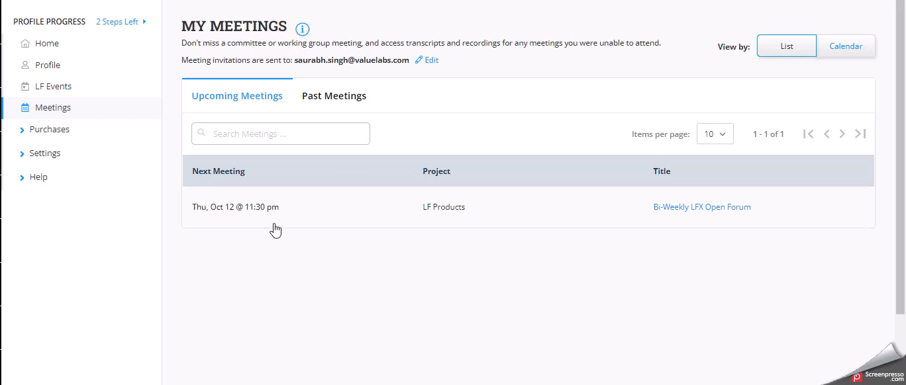

# Meetings

**My Meetings** provides you with a list of upcoming and past meetings. My Meetings also allows you to view past meeting recordings and transcript copies of the meetings.

You can view meetings in List View and Calendar View.&#x20;

## Accessing My Meetings&#x20;

You can access **My Meetings** from the Individual Dashboard.&#x20;

To access My Meetings, follow these steps:

1. Log into [My Profile](https://openprofile.dev) using your LF account, and from the left-side navigation pane, click **Meetings**.

### Viewing Meetings in List View

You can view upcoming and past meetings in the List View.&#x20;

To view meetings in List View, perform the following steps:

1. Log into [My Profile](https://openprofile.dev) using your LF account, and from the left side navigation pane, click **Meetings**.&#x20;
2. On the **My Meetings** page, select **List** View.
3. Under the **Upcoming Meetings** tab, you can view the list of meetings that provide details such as **Next Meeting** details, **Project, and Title** of the meeting.
4. Click the **Edit** icon to change the meeting invitation email settings.&#x20;
5. On the top of the **MY MEETINGS** page, you can see the upcoming meetings notifications. Click **Join Meeting** CTA to join the meeting.
6. Under the Past Meetings tab, you can view a list of past meetings that provides details such as **Date**, **Project**, **Title**, **Recording**, **Transcript,** and **Passcode**.&#x20;

### Add meetings to your Calendar

1. On the **Upcoming Meetings** tab, you will see the list of meetings.
2. Click on the meeting row to see the meeting details.
3. On the **Meeting Details** pop-up window, you will see the following details:

&#x20;       1\. Zoom link that you can copy and share.

&#x20;        2\. Resend Invitation CTA.

&#x20;        3\. Add to Calender CTA.

<figure><figcaption></figcaption></figure>

### Viewing Meetings in Calendar View

The calendar view provides details of the scheduled meetings on a calendar. The number of meetings planned for the day is shown on the date and day of the calendar. A table with details of the meetings is also available to check the following information related to the discussion:

* Time of the meeting
* Meeting Name
* Number of participants in the meeting
* Status of the attendance

You can categorize the meetings based on:

* All upcoming meetings
* Recurring meetings
* Non-recurring meetings
* Past meetings

To view meetings in List View, perform the following steps:

1. Log into [My Profile](https://openprofile.dev) using your LF account, and from the left navigation pane, click **Meetings**.&#x20;
2. On the **My Meetings** page, select **Calendar** View.

.gif>)
