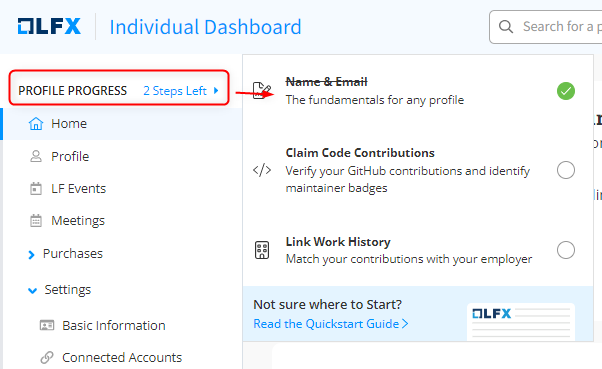

# Profile

On the left navigation pane of the individual dashboard, you will see the **Profile** section.  Navigating through the various options on this page will help you get acquainted with your individual dashboard.

#### 1. My Profile

The **My Profile** section provides details, such as your name, profile image, your organization's name, your role in the organization, an introduction about you, and technical and social accounts that are highlighted if you have connected any of them with your Linux Foundation account.

<figure><figcaption><p>Individual Dashboard</p></figcaption></figure>

#### 2. Profile Progress

The status shows your profile's progress. It shows the steps that are required to be completed before profile completion.

<figure><figcaption><p>Profile Progress</p></figcaption></figure>

#### 3. Connect accounts

Connect your GitHub and LinkedIn accounts to complete your profile. After completing the profile, you will receive a discount coupon worth 50% discount for LF training or certification on your profile under **My Rewards> Coupons.**

1. Click **LEARN MORE** to complete your profile.

<figure><figcaption></figcaption></figure>

&#x20;2\. On the next pop-up window, click **Get Started**.

<div align="center">

<figure><figcaption><p>Get Started</p></figcaption></figure>

</div>

3\. To claim your contributions, link your GitHub and LinkedIn accounts. Click **Link GitHub Account** to connect and authorize your GitHub account. After linking, you can claim your code contributions. Click **Set up later** if you do not want to link your accounts.

<figure><figcaption><p>GitHub settings</p></figcaption></figure>

4\. Click **Connect LinkedIn** to complete your profile**.** Connecting to LinkedIn will Quickly populate your work history through LinkedIn and verify that your technical contributions match up with your employers.

#### 4. Add additional Email addresses

Click **REVIEW EMAIL ADDRESSES** to review all the email addresses that you use to contribute or want to associate with your open-source profile.

<figure><figcaption><p>Additional Email Addresses</p></figcaption></figure>

Click **Add Email Address** to add your other Email addresses**.**

<figure><figcaption><p><strong>Add your Email Addresses</strong></p></figcaption></figure>


.png>) shows that the Email address is your primary Email address.


#### 5. About Me

The **About Me** section provides a rich markdown editor where you can write some interesting facts and information about yourself that reflect your interests, influence, or contributions to the open source community.

1. Click **Get Started** to write about yourself and your open source work experience.
2. Click **Save** to save your information.
3. Click  icon to edit **About Me** section if you want to update your information.

<figure><figcaption><p>About Me<br><strong>Note: Connect LinkedIn</strong> is displayed when you have not connected to the user account in the following image.</p></figcaption></figure>



The Linux Foundation values your privacy and does not share or use your data for marketing.


### View Profile Visibility, Profile Completion

From the right side pane of the window, you can view and manage profile visibility, view, and complete profile completion details, view any upcoming Linux Foundation events that you have registered for, and many more.

1. On the right side panel, you can see basic details, such as your profile image, your organization name, designation, and location. Click the _pencil icon_ to navigate to the [Basic Information](../know-your-individual-dashboard/about-me/update-profile-information.md#update-basic-information) section to make changes.
2. Below the basic details section, the icons of social accounts (LinkedIn) and technical accounts such as GitHub are listed. The icons are greyed or highlighted depending on their configuration. [Connect your LinkedIn and Git accounts](./#connect-or-disconnect-accounts) to add your open-source experience to your profile.

<figure><figcaption><p>Profile completion Page</p></figcaption></figure>

#### 5. Connect LinkedIn and GitHub

Connecting with LinkedIn and GitHub is the fastest and easiest way to affiliate your open-source contributions with your employment history. Your contributions are retrieved and displayed based on your unique usernames and email addresses that you have used to contribute to the open-source community.

Your affiliations also get published to **LFX Insights Community** Dashboards and your Organization Dashboards, highlighting your efforts to your employer.

#### Connect LinkedIn Account

To connect your LinkedIn account with your LF account, follow these steps:

1. Click .png>) icon on the profile complete page.
2. On the LinkedIn login page, enter your credentials. Click **Sign in.**

<figure><figcaption><p>LinkedIn login page </p></figcaption></figure>

3\. Review the **Settings >** **My Work History** page that displays your work history based on the work experience you have provided in your LinkedIn account.

<figure><figcaption><p>Work History<br><strong>Note:</strong> You can click <strong>Delete</strong> next to an organization name to remove the experience details to be displayed on your profile.</p></figcaption></figure>

#### Connect GitHub Account

To connect your GitHub account with your LF account, follow these steps:

1. Click  (1) (1) (1) (1) (1) (1) (1) (1) (1) (1) (1) (1) (1).png>) icon on the profile completion page.
2. On the next page, authorize your GitHub account.


To showcase your contribution on your open source profile, you can connect multiple GitHub accounts.


#### 6. Profile Visibility: (Public/Private)

This section displays if your profile is _public_ or _private_. Click the pencil icon to navigate to the [Profile Visibility](../settings/manage-profile-visibility.md#to-manage-profile-visibility) section to make changes. The URL includes the individual dashboard URL and your unique username, in the format `https://myprofile.dev.platform.linuxfoundation.org/profile/{{`_`unique_username`_`}}`

```
https://openprofile.dev/profile/johnlf2727
```
