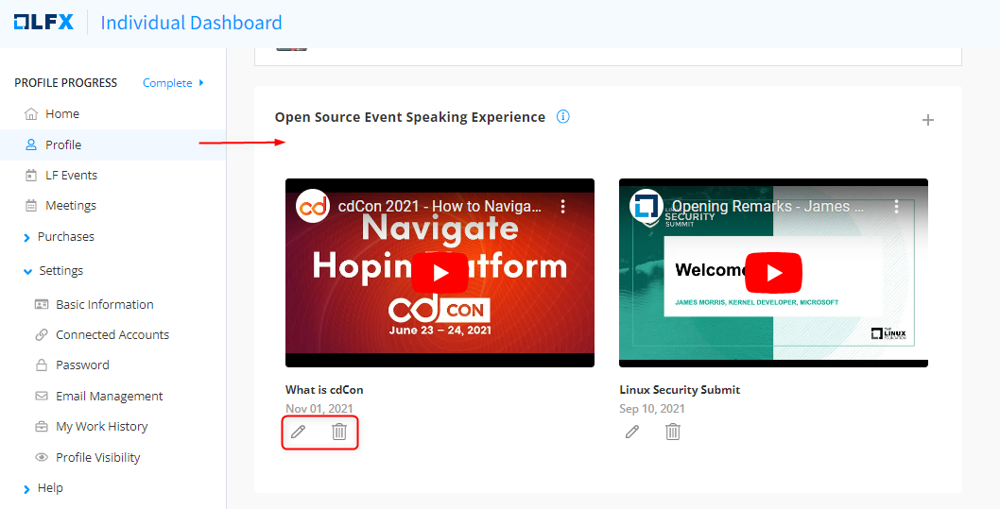

# Open Source Event Speaking Experience

This section lets you add or update an open-source event that you attended as a speaker. You can add any open-source events outside of the Linux Foundation as well. Adding your speaking experience greatly enhances your profile in the open-source community.&#x20;

To add an event that you attended as a speaker, follow these steps:

1. Click  icon to **Add Speaking Experience.**
2. Provide event details such as title, date of the event, presentation file, and youtube URL if there is any, and click **Submit**.

<figure><figcaption>
Add Speaking Experience CTA
</figcaption></figure>

<figure><figcaption>
Submit Speaking Experience
</figcaption></figure>

The following screen is displayed when you add one or more events that you attended as a speaker. You can edit or delete an event by clicking the edit (pencil icon) or delete icon on the event name.

<figure><figcaption>
Edit or Delete Speaking Experience
</figcaption></figure>

