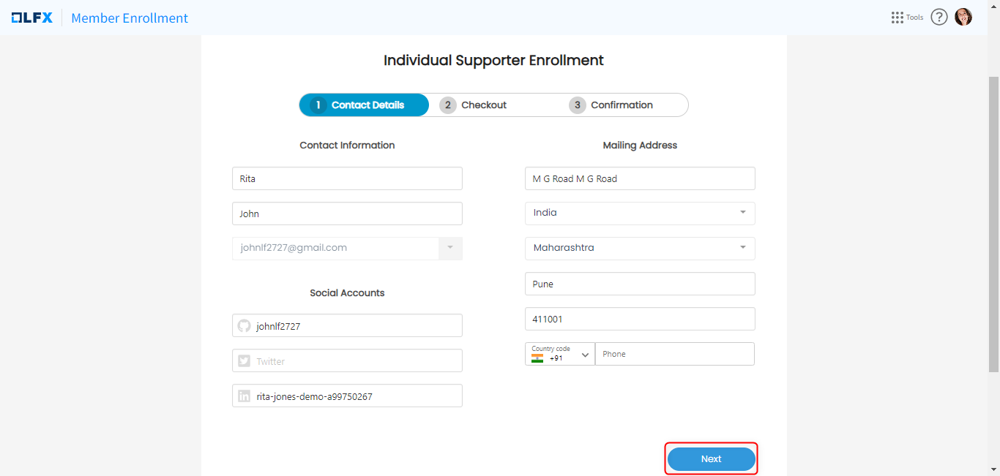

# Individual Enrollments

The **Individual Enrollments** page of the individual dashboard lets you view and manage your individual subscriptions as a user. By enrolling as an individual member or supporter, you show support for the Linux Foundation and its projects.

#### Why you should enroll:

* Get big discounts on certification, training, and events.
* Individual membership in the Linux Foundation saves you $100 off certification examinations, which you can utilize once.

#### To view all individual projects that are available to enroll in as an individual:

1. Log in to [https://openprofile.dev](https://openprofile.dev).
2. From the left navigation pane, navigate to **Purchases> Individual Enrollments**.
3. From the list of the available projects , click **Enroll as an Invidual Supporter** CTA to enroll.

<figure><figcaption></figcaption></figure>

4. On the **Member Enrollment** page, enter you contact details and click **Next**.

<figure><figcaption></figcaption></figure>

5. On the next page, enter your oder details and payment information.&#x20;
6. confirm your purchase.&#x20;

For each project, you can have one of the below individual status:

#### Not Enrolled

If you have never enrolled in that certain project. You can take the step and enroll from this page.

**Enrolled and Expired**

If your enrollment have been expired, and you didn't renew it. You can take the step and renew from this page.

**Enrolled and Expiring Soon**

If your enrollment will expire within 30 days, and you have disabled the Auto renew. You can activate the auto renew from this page to ensure the continues of your membership and its benefits.

**Enrolled and Active**

If your enrollment is active and the auto renew is enabled.

In this case you will have your membership to be renewed automatically.

.png>)

.png>)

3\. **Auto Renew:**

Auto renew is a toggle to enable or disable the **yearly automatic renewa**l on your behalf.

Enabling the auto renew, will automatically renew your next cycle before it will be expired in 1 day.

Disabling the auto renew, allow you to **renew manually**.

6\. To view all individual projects that you have enrolled in from my profile.

.png>)
