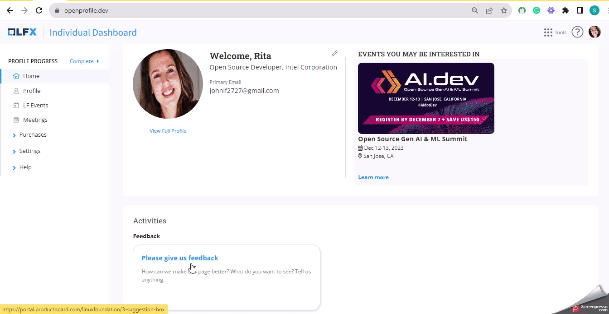

# Share Your Experience- Help Us Improve

Your ideas matter! Click anywhere on the **Feedback** card on the **Individual Dashboard** to share your thoughts and suggestions.

Help us shape the future of our community by providing your valuable feedback.&#x20;

**Quick Start Guide:**

1. **Click:** Tap anywhere on the **Feedback** card to get started.
2. **Share:** On the [next](https://portal.productboard.com/linuxfoundation/3-suggestion-box/tabs/21-under-consideration) page, click the **Submit idea CTA** to tell us your ideas, suggestions, or feedback.
3. **Submit:** Enter your email address and click the **Submit** button to share your thoughts!

<figure><figcaption></figcaption></figure>

Your input helps in our growth and helps us make your experience even better. Join us in making a difference!

Thank you for being a crucial part of our community's journey!
