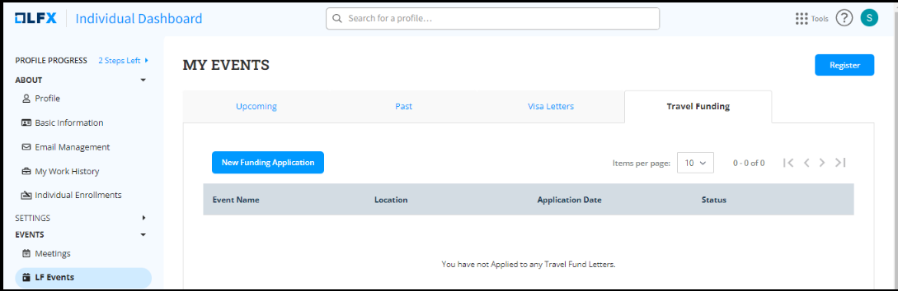
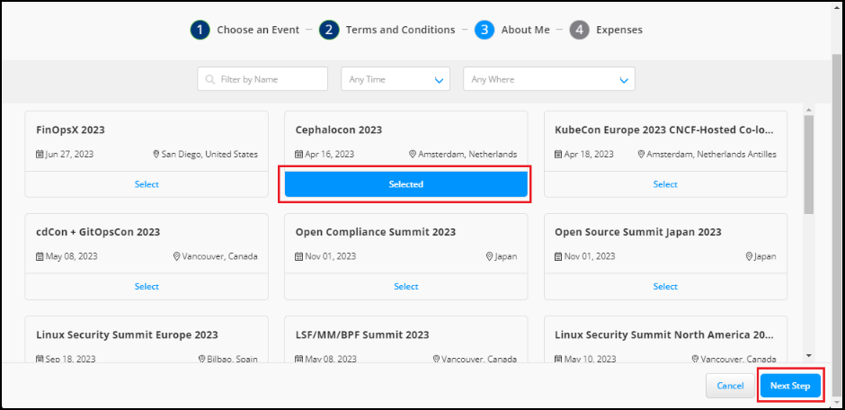
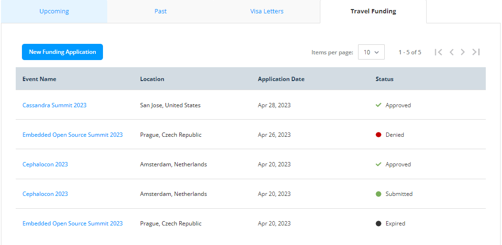

# Travel Funding

A travel funding request is a formal request made by an individual or group to a funding source, such as an employer or organization, to pay the expenses of attending an event, such as travel, accommodation, meals, and registration fees.

* The request includes a detailed budget and justification for the request.
* The funding source assesses the request based on various factors, including budget and significance to their objectives.
* The decision to approve or deny the request depends on the funding source's evaluation of the request.

To apply for the new fund requests, follow these steps:

1. Navigate to the [Individual Dashboard](https://openprofile.dev/) login page.
2. Enter your login credentials and sign in. For more information, see the [Sign in to Your Account](https://docs.linuxfoundation.org/lfx/sso/sign-in) page. If your login credentials are correct, you will be directed to the main dashboard or home page of the web UI.
3. From the left-side navigation pane, navigate to **EVENTS>LF Events**.
4. On the **MY EVENTS** page, click the **Travel Funding** tab. Click the **New Funding Application** CTA to access the application page.

<figure><figcaption>
New Funding Application
</figcaption></figure>

&#x20; 5\. On the **Travel Funding Application** page, scroll down and check the event that you want to attend. Click the **Select** button to choose the event. After selecting the event, click **Next**.

<figure><figcaption></figcaption></figure>

> <pre><code><strong>You can select the event by using the Filter by Name, Time, and Location search buttons given at the top of the Travel Funding Application Page.
> </strong></code></pre>

6\. On the **Terms and Conditions** page, read the terms and conditions for the visa application and click **Next**.

> * Click the **Cancel** button if you want to cancel your new travel fund application.
> * Click the **Previous Step** button to go back to the event selection page.
> * For questions, please contact [travelfund@linuxfoundation.org](mailto:travelfund@linuxfoundation.org).

7\. On the **About ME** page, fill out the following information to complete the application:

* **I am applying for:** From the drop-down, select if you are applying for yourself or for someone else.
* **Attendee Type:** Select whether you are attending the event or are invited as a speaker.
* **LFID Username:** It will be the default ID by which you logged in to the Individual Dashboard.
* **First and Last Name:** Enter your name if you are applying for yourself; otherwise, enter the name of the person for whom you are applying.
* **Email Address and Company:** Enter your email address and the company name if you are applying for yourself; otherwise, enter the email address and company name for whom you are applying.
* **Can you receive funds from your organization?:** Select from the drop-down.
* **Link to your LinkedIn, personal website, or GitHub page:**
* **If you checked Partial Assistance above, please explain what the company will or will not pay for:** If you select that you are getting partial help from your company, then explain in the text box.
* **Briefly describe the ways in which you are involved in technology and/or open source communities and why you’d like to attend this conference:** Enter your justification in the text box.

### Travel Fund Request Status 

Once you submit your request, you can see your application status on the **Travel Funding** page. \

<figure><figcaption></figcaption></figure>

Once your request is approved by the event team, you can see the status change as **Approved** on the **Travel Funding** page**.**
