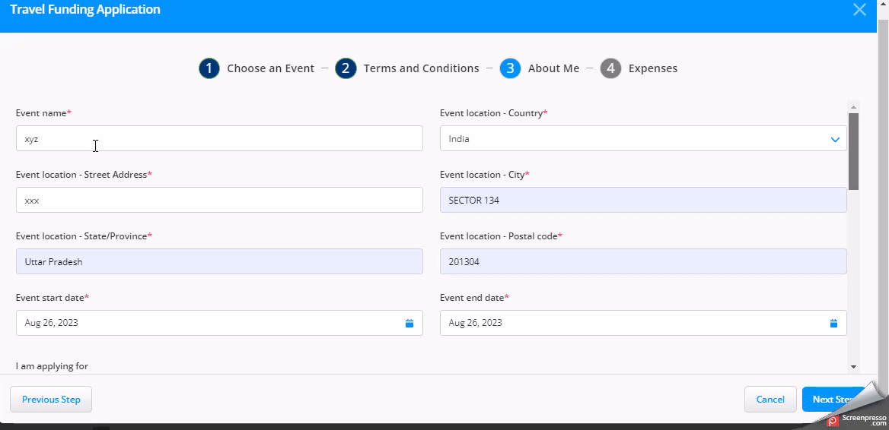

# Community Events Funding

To apply for the new fund requests, follow these steps:

1. On the **MY EVENTS** page, click the **Travel Funding** tab. Click the **New Funding Application** CTA to access the application page.
2. On the **Travel Funding Application** page, scroll down and select the **Community Event**. Click **Next**.
3. On the **Terms and Conditions** page, read the terms and conditions for the visa application and click **Next**.
4. On the **About Me** page, fill out the following information to complete the application:

<figure><figcaption></figcaption></figure>

5. Click **Next Step.**
6. On the **Expenses** page, fill in your expense details and submit the application.

