# Employee Management

Employee Management allows the administrators to manage the employees who are participating the development of open source projects. It provides an overview of employees who are participating in various open source projects along with their roles.&#x20;

Employee Management allows the administrators to perform the following functions:

* Adding a new employee&#x20;
* List view of employee associated with a project
* Filtering of employees&#x20;
* Profile view of an employee
* Removing an employee from  an organization&#x20;
* Exporting list of employees to an XLS sheet

## Accessing Employee Management

To access the employee management, perform the following steps:

1.Login to [Organization Dashboard](https://myorg.lfx.dev).

2.On the vertical sidebar navigation menu, click **Employees**.

<figure><figcaption>
Employees
</figcaption></figure>

## Inviting an Employee

Administrator can invite a new employee who is contributing to a particular open source project.&#x20;

To invite a new employee to a project, perform the following steps:

1.Click **Employee** menu from the vertical sidebar menu.

2.The Employee page appears. Click **+Invite to LFX** button available on the top right of the page.&#x20;

<figure><figcaption>
Invite Link
</figcaption></figure>

3.The **Invite to LFX** dialog appears. You can invite an employee by providing the email ID or bulk import by upload the CSV file.&#x20;

Select **Enter Recipient** radio button, enter the **Recipients** email ID and click **Send Invitation** button to invite a new employee.

<figure>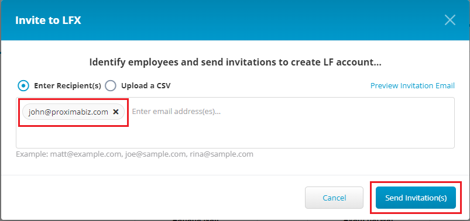<figcaption>
Recipient Email
</figcaption></figure>

To invite bulk employee,  select **Upload a CSV** radio button, drag and drop the CSV file which has employee details and click **Send Invitation(s**) button. &#x20;

<figure>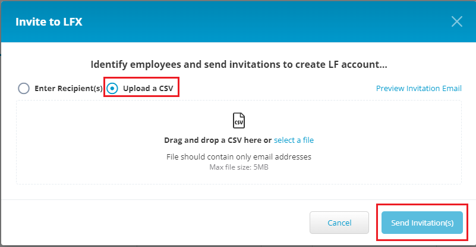<figcaption>
Upload
</figcaption></figure>


The **Preview Invitation Email** link will provide the preview of the email invitation which will be shared with the invitee. The Preview email contains the details about the invitation as well as FAQs related to the Organization Dashboard.&#x20;


4\. An invitation link will be shared with the recipient. The employee should update the details from the invitation that has been shared to add themselves as new employee for an open source project.&#x20;

## List View of Employees

Administrators can see the list of employees assigned with a particular open source project.&#x20;

To view list of employees belonging to a particular open source project, perform the following steps:

1.Click **Employee** menu from the vertical sidebar menu.

2.You can view list of employees belonging to a particular open source project by selecting the required open source project from the **View Employees by Project** drop-down list.&#x20;


You need to click **Clear** to clear the selected project to view list of all employees.


<figure>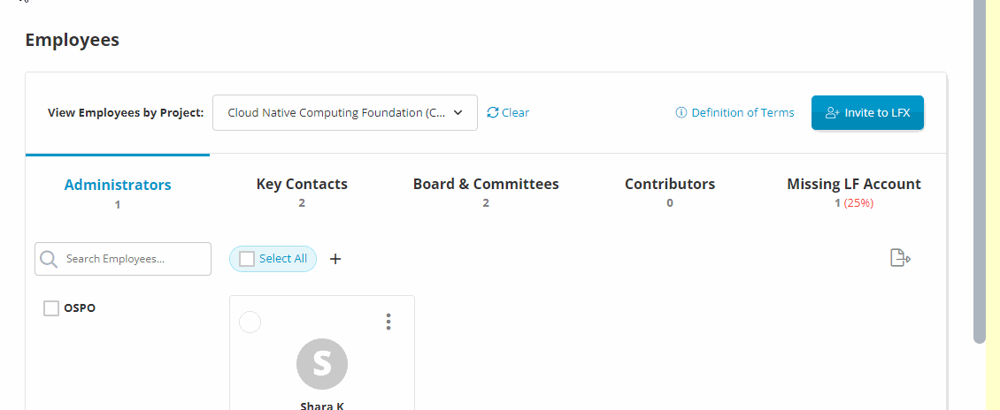<figcaption>
View Employee by Project
</figcaption></figure>

## Filtering of Employees&#x20;

Administrator can filter employees to based on the roles, LF accounts, Key contacts, Open Source Program Offices (OSPO), Board and Committees, Maintainers, Most Active, Least Active, Recently Joined and Alphabetic.&#x20;

<figure><figcaption>
Employee Filters
</figcaption></figure>

### Filter by Missing LF Account&#x20;

Missing LF Accounts are those  employees who does not have LF account associated with their profiles.&#x20;

To filter employees by Missing LF Account, perform the following steps:

1.Click **Missing LF Account**. The employees are filtered by Missing LF Account.

&#x20;

<figure><figcaption>
Missing LF Account 
</figcaption></figure>

### Filter by Administrators

Administrators are those employees who are assigned with the administrator role.

To filter employees by Administrator, perform the following steps:

1.Click **Administrator**. The employees are filtered by Administrator.&#x20;

<figure>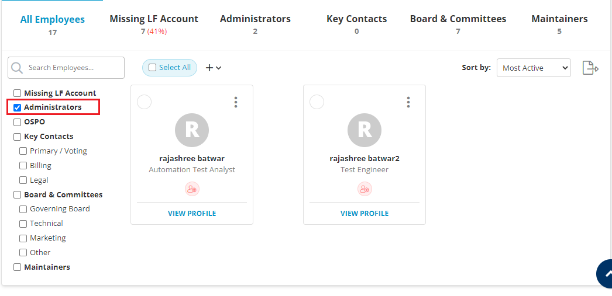<figcaption>
Filter by Administrator 
</figcaption></figure>

### Filter by OSPO

To filter employees by OSPO, perform the following steps:

1.Click **OSPO**. The employees are filtered by OSPO.

<figure>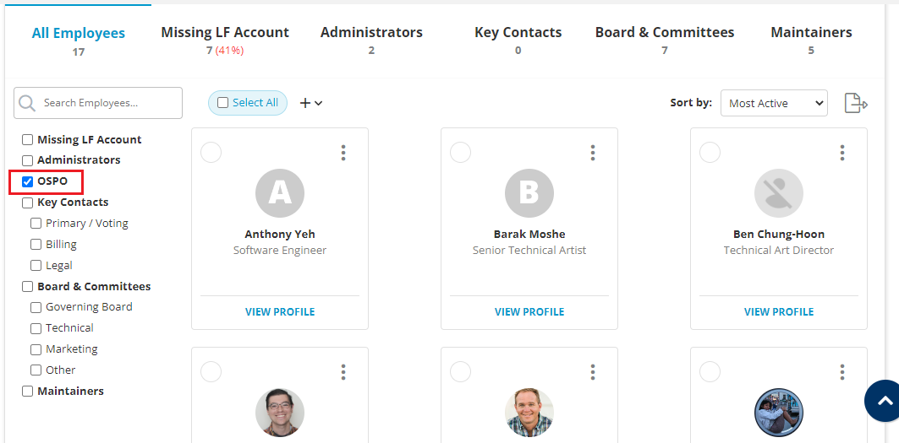<figcaption>
Filter by OSPO
</figcaption></figure>

### Filter by Key Contacts

Key Contacts are those employees who are assigned with the few important and specific roles such as primary or voting, billing and legal.&#x20;

To filter employees by Key Contacts, perform the following steps:

1.Click **Key Contacts**. The employees are filtered by Key Contacts.


You can again filter key contacts based on Primary/Voting, Billing and Legal.&#x20;


<figure><figcaption>
Filter by Key Contacts
</figcaption></figure>

### Filter by Board and Committees

You can filter employees belonging to different boards and committees such as Governing board, Technical, Marketing and other boards.&#x20;

To filter employees by Board and Committees, perform the following steps:

1.Click **Board and Committees**. The employees are filtered by  Board and Committees.


You can again filter Board and Committees based on Governing board, Technical, Marketing and other boards.&#x20;


<figure><figcaption>
Filter by Board and Committees
</figcaption></figure>

### Filter by Maintainers

Maintainers are those employees who maintain the open source project. Maintainers normally build source code into a binary package for distribution, commit Pull Requests, or organize code in a source repository.

To filter employees by Maintainers, perform the following steps:

1.Click **Maintainers**. The employees are filtered by Maintainers.&#x20;

<figure>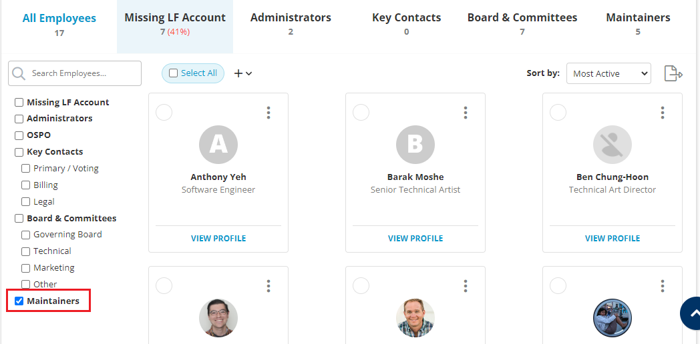<figcaption>
Filter by Maintainers 
</figcaption></figure>

### Filter by Most Active

Most Active employees are those who have actively contributing to the project within last one month.

To filter employees by Most Active, perform the following steps:

1.Click **Most Active**. The employees are filtered by Most Active.&#x20;

<figure>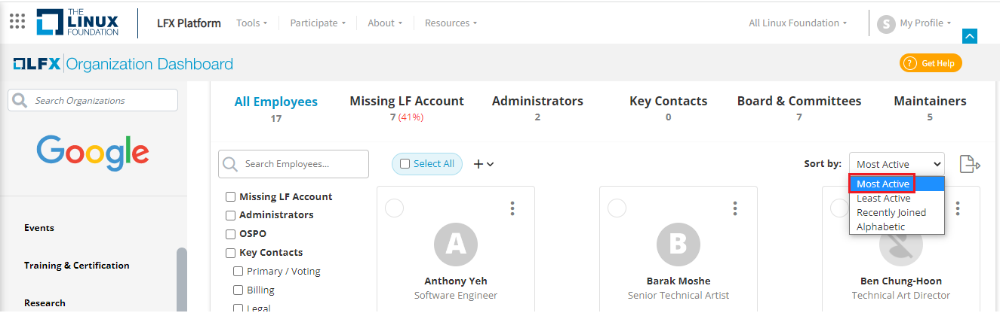<figcaption>
Filter by Most Active 
</figcaption></figure>

### Filter by Least Active

Least Active employees are those who are not actively contributing to the project within a specified time frame.

To filter employees by Least Active, perform the following steps:

1.Click **Least Active**. The employees are filtered by Least Active.

<figure><figcaption>
Filter by Least Active 
</figcaption></figure>

### Filter by Recently Joined

Recently Joined employees are those who have joined the project recently and started contributing to the project.&#x20;

To filter employees by Recently Joined, perform the following steps:

1.Click **Recently Joined**. The employees are filtered by Recently Joined.

<figure>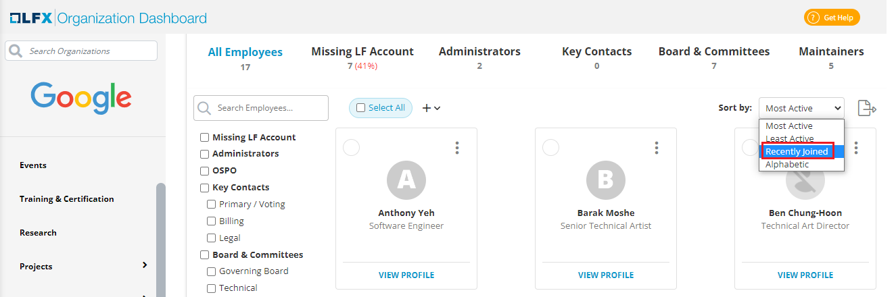<figcaption>
Recently Joined 
</figcaption></figure>

### Filter by Alphabetic

Filter by alphabetic option allows you to filter the employees by the alphabetic sequence of the employee names.&#x20;

To filter employees by Alphabetic, perform the following steps:

1.Click **Alphabetic**. The employees are filtered by Alphabetic.

<figure>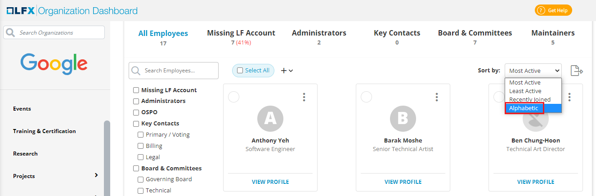<figcaption>
Filter by Alphabetic
</figcaption></figure>

## Profile View of an Employee

You can view the details related to an employee by viewing their profile. Profile View provides the following details related to the employee:

* Name of the employee
* Designation of the employee
* Project name for which employee is associated with
* List of repositories for which the employee is a maintainer&#x20;
* Edit option to update the repositories&#x20;

To view the profile of an employee, perform the following steps:

1.Click **View Profile** from the employee card.&#x20;

<figure>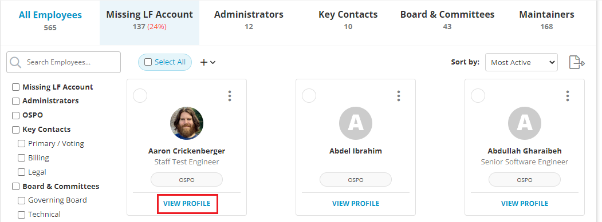<figcaption>
View Profile 
</figcaption></figure>

2.The Profile dialog box appears with all the details.&#x20;

<figure><figcaption>
Employee Details 
</figcaption></figure>

## Removing an Employee

Administrator has an option to remove an employee from a project. &#x20;

To remove an employee from the project, perform the following steps:

1.Click the ellipsis  icon and select **Remove from Organization**.&#x20;

<figure><figcaption>
Remove Employee
</figcaption></figure>

2.A confirmation message dialog box appears. Click **Remove** to remove an employee.&#x20;

<figure>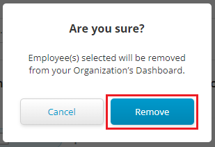<figcaption>
Confirmation Message 
</figcaption></figure>

## Downloading the Employee List

You can download or export list of employees in a XLS sheet.&#x20;

To download the employee list, click the download icon. The XLS sheet with list of employee will be downloaded to the local system. &#x20;

<figure>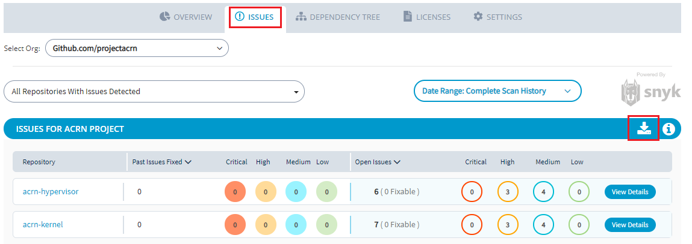<figcaption>
Download 
</figcaption></figure>

## Tagging an Employee as OSPO

You can tag the required employee as OSPO leader.&#x20;

To tag an employee as OSPO leader, click the  icon and select the tag  icon and click **OSPO Leader**. The employee is tagged as OSPO leader.&#x20;


You can remove the OSPO tag by clicking the x mark. &#x20;


<figure>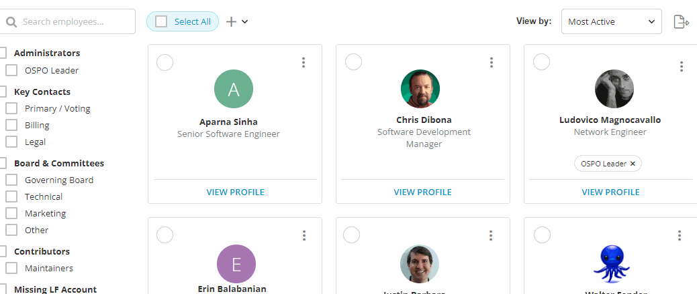<figcaption>
OSPO Tag
</figcaption></figure>
