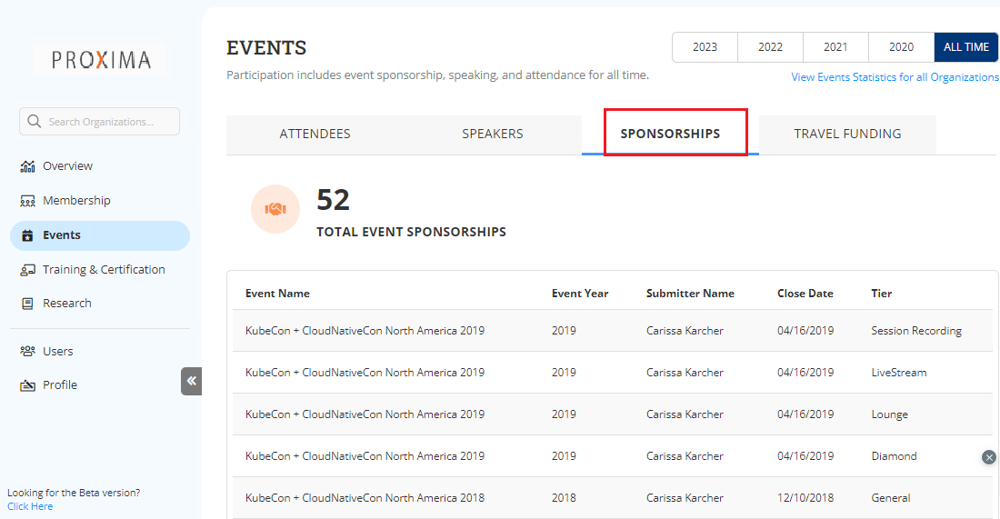

# Sponsorship Insights

Sponsorship insights tab under Events provides you a complete insights on sponsorship events.&#x20;

The following list provides you the complete details that can extracted from the Sponsorship Insights:

* Name of the event sponsored&#x20;
* Year in which the even was organized
* Name of the employee who has submitted the even sponsorship&#x20;
* Closed date when the even got closed
* Tier provides type of sponsorship provided to the event&#x20;

<figure><figcaption>
Sponsorship 
</figcaption></figure>

