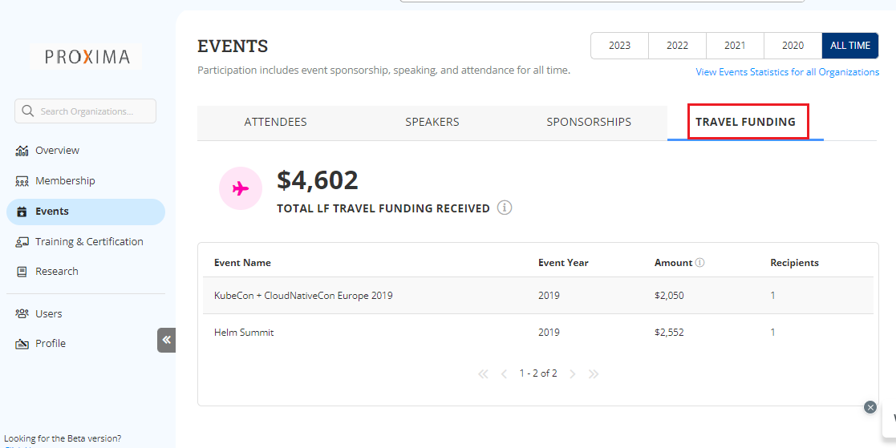

# Travel Funding

Travel Funding tab provides the estimated travel funds allocated from the Linux Foundation to an organization to participate in various events.&#x20;

The following list provides you the complete details that can extracted from the Travel Funding:

* Total travel fund received from the Linux Foundation
* Name of the event for which the travel funding has been received&#x20;
* Year in which the event is organized
* Estimated travel fund received for a particular event&#x20;
* Number of recipients allocated with the travel fund&#x20;


You can check the events details for last four years or all time details.&#x20;


<figure><figcaption>
Events 
</figcaption></figure>
