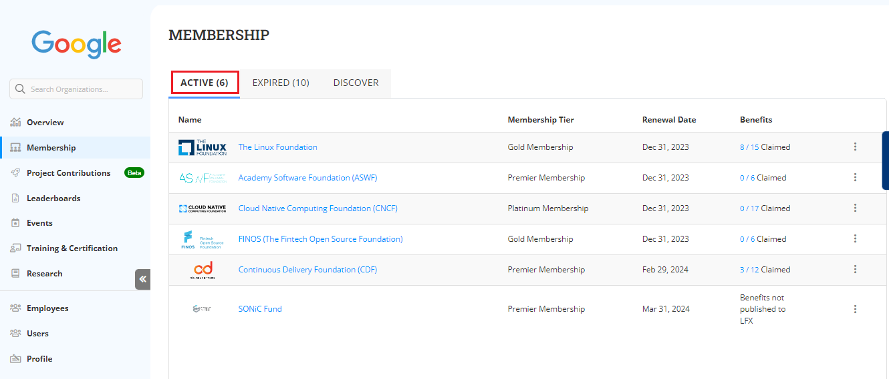

# Active Memberships in your Organization

Active Membership tab under Membership provides you an overview on the active membership availed by your organization for various open source projects. This table provides you the following details related to the active membership:

* Open source project name for which your organization has availed the membership.
* Type of membership that your organization has purchased.
* Renewal date of the membership.
* Benefits claimed from the membership.

<figure><figcaption>
Active Membership
</figcaption></figure>

### Managing your Team

You can manage your employees using Manage you Team. Click the  icon and select **Manage Team**.  For more information on Manage Team, refer [Manage Teams](https://docs.linuxfoundation.org/lfx/organization-dashboard/employee-management).&#x20;

<figure><figcaption>
Manage Team
</figcaption></figure>

### Contacting Support Team

You can contact the support team if you are facing any issues related to Organization dashboard. Click the  icon and select **Contact Support**.&#x20;

<figure><figcaption>
Support
</figcaption></figure>

### Viewing your Membership Summary

You can check the membership details.  Click the  icon and select **View Membership Summary**.  For more information on membership summary,  refer [Membership Details](https://docs.linuxfoundation.org/lfx/organization-dashboard/projects/membership-details-of-a-project).&#x20;

<figure><figcaption>
Membership Summary
</figcaption></figure>
