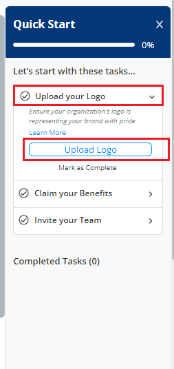

# Onboarding Widget

The onboarding widget which is available on the right side of the application will help you to setup the organization and invite members to the  organization.&#x20;

To access onboarding widget, perform the following steps:

1.Click Quick Start ribbon available on the right side of the application.&#x20;

<figure><figcaption>
Quick Start 
</figcaption></figure>

2.The Quick Start widget appears. Expand Upload your Logo drop-down. Click Upload Logo button to upload the logo for your organization. Select the required logo and click OK.  Click Mark as Complete to complete the logo update process. For more information on how to upload logo, refer to [Updating Organization Details](https://docs.linuxfoundation.org/lfx/organization-dashboard/organization-profile#updating-the-https://docs.linuxfoundation.org/lfx/organization-dashboard/organization-profile#updating-the-organization-details-details).&#x20;

<figure><figcaption>
Upload Logo
</figcaption></figure>

3.Expand the Claim your Benefits drop-down and click&#x20;
