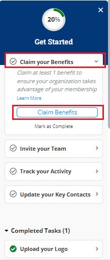
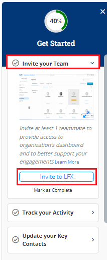
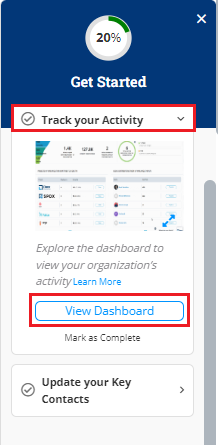
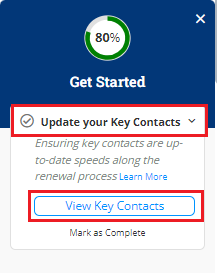
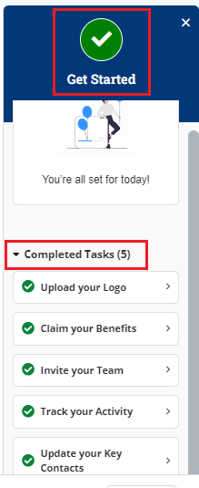

# Onboarding Widget

The onboarding widget which is available on the right side of the application will help you to setup the organization and invite members to the  organization.&#x20;

To access onboarding widget, perform the following steps:

1.Click **Quick Start** ribbon available on the right side of the application.&#x20;

<figure><figcaption>
Quick Start 
</figcaption></figure>

2.The Quick Start widget appears. Expand **Upload your Logo** drop-down. Click **Upload Logo** button to upload the logo for your organization. Select the required logo and click OK. Click **Mark as Complete** to complete the logo update process. For more information on how to upload logo, refer to [Updating Organization Details](https://docs.linuxfoundation.org/lfx/organization-dashboard/organization-profile#updating-the-https://docs.linuxfoundation.org/lfx/organization-dashboard/organization-profile#updating-the-organization-details-details).&#x20;

<figure><figcaption>
Upload Logo
</figcaption></figure>

3.Expand the **Claim your Benefits** drop-down and click **Claim Benefits** to claim benefits associated with your organization. Click **Mark as Complete** to complete the benefit claim process. For more information on how to claim benefit, refer to [Membership](https://docs.linuxfoundation.org/lfx/organization-dashboard/membership).&#x20;

<figure><figcaption>
Benefits 
</figcaption></figure>

3.Expand the **Invite your team** drop-down and click **Invite to LFX** to invite your teammate to access organization dashboard. Click **Mark as Complete** to complete the invitation process. For more information on how to invite to LFX, refer to [Inviting an Employee](https://docs.linuxfoundation.org/lfx/organization-dashboard/employee-management#inviting-an-employee).&#x20;

<figure><figcaption>
Invite to LFX
</figcaption></figure>

4.Expand the T**rack your Activity** drop-down and click **View Dashboard** to view your organization dashboard. Click **Mark as Complete** to complete viewing of the dashboard. For more information on organization dashboard, refer to [Organization Dashboard](https://docs.linuxfoundation.org/lfx/organization-dashboard/overview#organization-dashboard-components).&#x20;

<figure><figcaption>
Dashboard
</figcaption></figure>

5.Expand the **Update your Key Contacts** drop-down and click **View Key Contacts** to view contacts of your organization. Click **Mark as Complete** to complete viewing of the contacts. For more information on Employee Management, refer to [Employee Management](https://docs.linuxfoundation.org/lfx/organization-dashboard/employee-management).&#x20;

<figure><figcaption>
Key Contacts 
</figcaption></figure>

6.Once you have completed all the activities, you can see the completed tasks along with the green tick mark under the completed tasks and green tick with **Get Started** appears on top of the widget.&#x20;

<figure><figcaption>
Completed Tasks 
</figcaption></figure>
