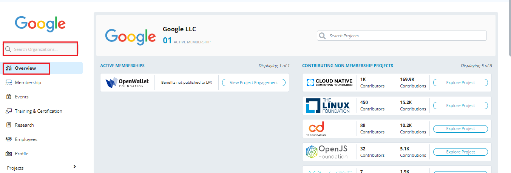

# Overview

The Organization Dashboard provides a powerful dashboard for companies or organizations that assists you in envisioning complex data into easy-to-read and meaningful data. The Organization Dashboard enables you to gather, combine, and organize key project data from a single console. The Organization Dashboard provides dashboards, charts, and widgets that will analyze and display Key Performance Indicators (KPIs), metrics, and key data points related to the management of your projects.

## Key Benefits of Organization Dashboard 

Some of the key benefits of using the Organization Dashboard are listed in the following list:

* Manage critical and complex projects from a single console.
* Visually interactive graphs and charts with a consistent UI across all the dashboards.
* Consolidate the critical information scattered across the organization at your fingertip.
* A highly customizable dashboard that allows you to quickly access the required information instantly.
* Provides you with assessments of how the organization is doing across various projects.
* Provides the required information to the stakeholders without too much of unnecessary confusion.
* A user-friendly UI that allows the user to grasp the required information with great ease.
* Provides various widgets that allow you to quickly get information on the top-performing indicators.

## Organization Dashboard Components 

Organization Dashboard provides various components that allow you to manage your organization in a much more efficient way. Along with managing your organization, it also provides information on various global-level statistics. It also assists you in managing your teams and managing your organization profile. The following components are available in the Organization Dashboard console:

* Overview Dashboard - Overview  provides you various charts related to your organization.  Some of the charts that are displayed are:
* Membership - Membership provides you to manage your organization memberships.
* Events - Events allows you to manage events.&#x20;
* Training and Certification - Training and Certifications allow you to manage training and certifications.
* Research -  Research explores the dynamics of open source technologies, standards, and communities, and their impact on the global economy.
* Employee - Employee allows you to manage employees of your organization.&#x20;
* Projects - Projects provide you with a summary related to a specific foundation or project.
* Global Statistics - Global Statistics provides you with global reports related to events, training, and certifications across all organizations.
* Organization Profile - The Organization Profile allows you to update details related to your organization.

## Overview of Organization Dashboard

Organization Dashboard provides an interactive dashboard with data visualizations that assist you to easily understanding and monitor the data with with great ease. The organization dashboard provides you with the following information:

* **Active Membership** - The dashboard provides information on the active membership.
* **Contributing Non Membership Projects** - The dashboard also provides you information related to the contribution provided by your company on various open source projects even without having membership for that project.
* **Project contribution** - The dashboard provides you with a project contribution widget that provides you details such as the total project contribution by your organization, the total number of commits, the total number of codes, and all other details related to the project contribution.
* **Events** - A dashboard on events that will give you an insight into what all open source events the company has sponsored, who all attended and spoke from your organization in those open source events, and other details related to event management.
* **Training and certifications** - This dashboard assists you in gathering information on training and certifications. This dashboard also assists you in managing the discounts and coupon codes available for your organization.

## Accessing Organization Dashboard

To access your Organization Dashboard, perform the following steps:

1.Login to [Organization Dashboard](https://myorg.lfx.dev).

2.On the vertical sidebar navigation menu, in the **Search** box; enter your company or organization name. By default, the dashboard page appears.


You can also click the **Dashboard** menu available on the Vertical Sidebar navigation menu.


<figure><figcaption>
Overview
</figcaption></figure>
