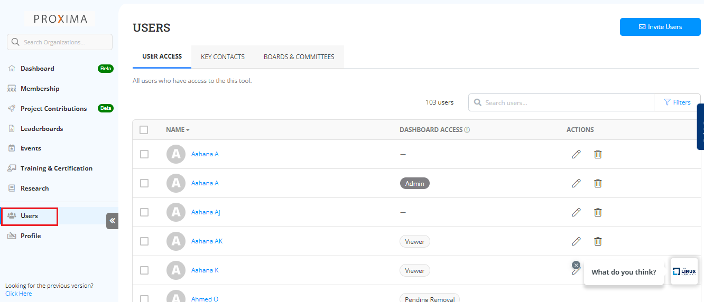

# Users Management

The User Management page allows users in navigating access and managing roles within their memberships. This page also provides information on the following topics:

* User Access
* Key Contacts
* Boards and Committees \


The Employees tab is replaced by Used tab in the latest release.&#x20;


## Accessing User Management

To access the Users management, perform the following steps:

1.Login to [Organization Dashboard](https://myorg.lfx.dev).

2.On the vertical sidebar navigation menu, click **Users**.

<figure><figcaption>
Users
</figcaption></figure>
