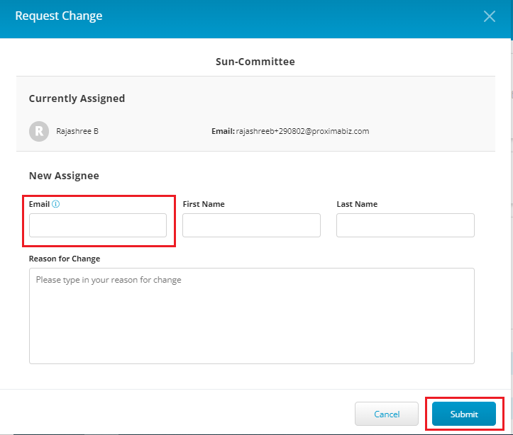

# Boards and Committees

The Board and Committees tab is dedicated to displaying and managing who has access to the Organization Dashboard. The Board and Committees list provides list of users from your organization along with their affiliated roles and the appointed by.&#x20;


Users will not be able to see Missing to LFX and only see users who need access based on their invitation or roles they are associated with your organization.&#x20;


The Board and Committees page also performs the following actions:

* List of users in list view and group view.&#x20;
* Filtering of users&#x20;
* Profile view of the user&#x20;
* Edit access of a user

## Board and Committees table

The Board and Committees table provides you with a list of users from your organization along with their with their affiliated roles. You can view the Board and Committees users in a list or  in a group view. List View provides you the list of users with their affiliated roles and group view provides you with the list of users grouped for a particular project. It also provides group view of different committees in the project.&#x20;

You can use the toggle button to display Board and Committees users in Group View or List View.

<figure><figcaption>
Board and Committees Table 
</figcaption></figure>

## Filtering of Boards and Committees Users

Administrator can filter Boards and Committees users based on a particular project.&#x20;

To filter Boards and Committees users by project, perform the following steps:

1.Click **Filters**.  Select the required project and click **Apply**.

<figure><figcaption>
Filters
</figcaption></figure>

## Profile View of a Board and Committee User

You can view the details related to a Board and Committee user by viewing their profile. Profile View provides the following details related to the user:

* Name of the Board and Committee user
* Activities associated with the key contact such as Technical, Events and Trainings&#x20;
* Project name for which Board and Committee user is associated with
* List of repositories for which the Board and Committee user is a maintainer &#x20;

To view the profile of a Board and Committee user, perform the following steps:

1.Click the Name.

<figure><figcaption>
Profile  Name
</figcaption></figure>

2.The Profile dialog box appears with all the details.&#x20;

<figure><figcaption>
Profile Details 
</figcaption></figure>

## Edit Board and Committees User

Administrator can edit the user belonging to board and committee.&#x20;

To edit Board and Committee user, perform the following steps:

1.Click the edit icon associated with a user.

<figure><figcaption>
Edit 
</figcaption></figure>

2.The Profile Snapshot of the user appears. Click **Request Change**.&#x20;

<figure><figcaption>
Request Change
</figcaption></figure>

3.The Request Change dialog box appears. Provide the **Email** of the new assignee and give a brief **Reason for the Change** and click **Submit**.&#x20;


* Program Management team should validate the change request.&#x20;
* In order to delete the user, you need to raise the [customer Support](https://jira.linuxfoundation.org/plugins/servlet/desk/portal/4/create/467) ticket.&#x20;


<figure><figcaption>
Submit
</figcaption></figure>
