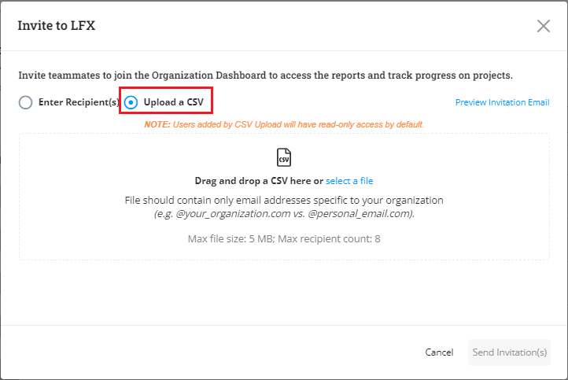
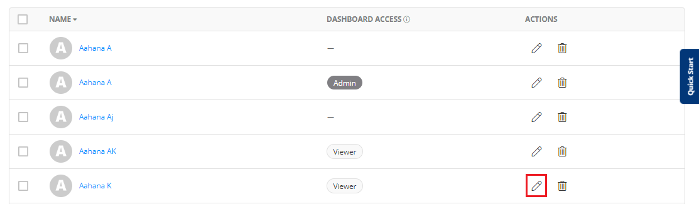

# User Access

The User Access page allows you to display and manage who has access to the Organization Dashboard. The User Access page also performs the following actions:

* List of users with admin and viewer access in your organization.&#x20;
* Invite users to the organization
* Filtering of users
* Profile view of user
* Delete a user
* Edit access of a user


Users will not be able to see Missing to LFX and only see users who need access based on their invitation or roles they are associated with your organization.&#x20;


<figure><figcaption>
User Access
</figcaption></figure>

## User Access table

The User Access table provides you with a list of users from your organization along with their dashboard access whether they have admin or view access to the dashboard. It also displays if a user is in a pending invite or removal state.&#x20;


An **Admin** user has Grants privileges such as editing, inviting or removing user access, editing or removing key contacts, requesting changes in membership entitlement roles, and editing the profile.

A **Viewer** user can view and download reports.


<figure><figcaption>
User Access
</figcaption></figure>

## Inviting a User

Administrator can invite a new user who is contributing to a particular open source project.&#x20;

To invite a new user to a project, perform the following steps:

1.Click **User** menu from the vertical sidebar menu.

2.The User page appears. Click **Invite Users** button available on the top right of the page.&#x20;

<figure><figcaption>
Invite User 
</figcaption></figure>

3.The **Invite to LFX** dialog appears. You can invite a user  by providing the email ID or bulk import by upload the CSV file.&#x20;

Select **Enter Recipient** radio button, enter the **Recipients** email ID, select the role that you want to provide the user (admin or viewer role), click  Add and click **Send Invitation(s)** button to invite a new user.


You can add up to 8 users at a time while sending out the invitations.&#x20;


<figure><figcaption>
Send Invitation 
</figcaption></figure>

To invite bulk users(user belonging to your organization),  select **Upload a CSV** radio button, drag and drop the CSV file which has user details and click **Send Invitation(s**) button. &#x20;

<figure><figcaption>
Bulk Invitation
</figcaption></figure>

4\. An invitation link will be shared with the recipient. The user should update the details from the invitation that has been shared to add themselves as new employee for an open source project.&#x20;


The **Preview Invitation Email** link will provide the preview of the email invitation which will be shared with the invitee. The Preview email contains the details about the invitation as well as FAQs related to the Organization Dashboard.&#x20;


## Filtering of Users

Administrator can filter users based on access (admin or viewer access).&#x20;

To filter users by access, perform the following steps:

1.Click **Filters**.  Select the required access and click **Apply**.&#x20;

<figure><figcaption>
Filters
</figcaption></figure>

## Profile View of a User

You can view the details related to a user by viewing their profile. Profile View provides the following details related to the user:

* Name of the user
* Activities associated with the user such as Technical, Events and Trainings&#x20;
* Project name for which user is associated with
* List of repositories for which the user is a maintainer &#x20;

To view the profile of a user, perform the following steps:

1.Click the User Name.

<figure><figcaption>
User Profile 
</figcaption></figure>

2.The Profile dialog box appears with all the details.&#x20;

<figure><figcaption>
Profile Details 
</figcaption></figure>

## Editing User Access&#x20;

Administrator can edit the access of the user from Admin to Viewer or the other way.&#x20;

To edit the  user access, perform the following steps:

1.Click the pencil icon available under the Actions column.&#x20;

<figure><figcaption>
Edit 
</figcaption></figure>

2.The Edit Access dialog box appears. Click **Save Changes** to update the access.&#x20;


The **Remove all access** button will initiate the deletion of the  user.&#x20;


<figure><figcaption>
Save Changes 
</figcaption></figure>


There will not be any automated email sent to the user. The Administrator has to inform the user about the update to their access. &#x20;


## FAQ's on User Access

**Q: When you delete a user, what happens if they are in a failed state?**

* You will not be able to successfully delete the user. Some actions to reassign and remove roles will appear, however the remaining ones are the ones that have been removed/changed.

**Q: When you delete a user what happens?**

* The user you’ve deleted no longer has access to the Organization Dashboard.
* Any future company affiliation data from the user will no longer appear - Training, Events, Project Contributions, etc. You’ll still see their past activity data.
* All the reassignment/edits will appear instantaneously on the users.

**Q: What if I no longer see Committee seats for my Active Membership?**

* Before deleting a user, always ensure the Committee seats are checked and coordinated with the Program Manager for proper reassignment.
