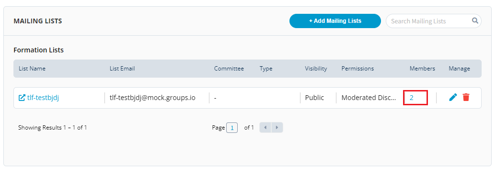

# Mailing List

Mailing List is a collection of names and addresses used by an individual or an organization to send material to multiple recipients. PCC allows you to setup different mailing lists which will allow you to send emails to different mailing lists.

## Enabling Mailing List for Groups.IO 

In order to send an email to a particular mailing list, you need to enable the mailing list first.

To enable the Mailing List, perform the following steps:

1.Login into PCC.

2\. Search for the required project. The Project dashboard appears. Click **Mailing Lists** from the **Collaboration** tab.


You can also navigate to Mailing List from the Vertical Sidebar navigation menu. Click **Collaboration** and then select **Mailing Lists**.


<figure><figcaption>
Mailing List
</figcaption></figure>

3.The Mailing List page appears. You need to enable the Mailing List first. Click **+Add Mailing Lists**.

4.The Add Mailing List page appears. Click **Next** and enter the following details \*\*\*\* to configure mailing list.

| **Field**                  | **Action**                                                                                                                                                                                                                                                                                                                                                                                                                                                                                   |
| -------------------------- | -------------------------------------------------------------------------------------------------------------------------------------------------------------------------------------------------------------------------------------------------------------------------------------------------------------------------------------------------------------------------------------------------------------------------------------------------------------------------------------------- |
| List Name                  | Enter the name of the mailing list                                                                                                                                                                                                                                                                                                                                                                                                                                                           |
| Posting Permissions        | 
Select the required posting permissions. There are three type of permissions: - <strong>Moderated Discussions</strong>: New members cannot post to the list without their emails being approved by a moderator. For new lists, this uses a Groups.io setting that will only moderate users for their first 3 posts. - <strong>Open Discussion</strong>: New members can immediately post to the list. - <strong>Announcement</strong>: Only moderators can post to the list.
 |
| Select Associate Committee | Select the required committee                                                                                                                                                                                                                                                                                                                                                                                                                                                                |
| Description                | Provide a description for the mailing list                                                                                                                                                                                                                                                                                                                                                                                                                                                   |

The Mailing list page also provides you with a list of different ways to configure mailing list.

You can configure mailing list in three different ways:

* You can configure mailing list using existing PCC connected Groups.io domain.
* You can configure by setting up your own Groups.io email domain for the project.
* You can configure existing Groups.io domain which is not connected to PCC.

## Adding Members to the Mailing List

You can added the required members in the mailing list.

To add a new member to the mailing list, perform the following steps:

1.Go to the Mailing List and click on the **Members** listed in the Mailing List.

2\. The Manage List Members page appears with list of members available in the mailing list. Click **+ Add New List Member** to add a new member to the mailing list.

3.The Add New List Member dialog box appears. Update the following details and click **Add Member** and then click **Save** to update the changes:

| **Field**    | **Action**                           |
| ------------ | ------------------------------------ |
| Email        | Enter the email ID of the member     |
| Full Name    | Enter the full name of the member    |
| Job Title    | Enter the job title of the member    |
| Organization | Enter the organization of the member |


To delete a member from the list, go to the Manage List Members page and click delete  icon listed in front of the member name.


## Managing Committee 

You can manage the committee for the mailing list, for more details, please refer [Managing Committee](https://docs.linuxfoundation.org/lfx/project-control-center-pre-release/setup-services-for-a-project/committees-setup-for-a-project).
