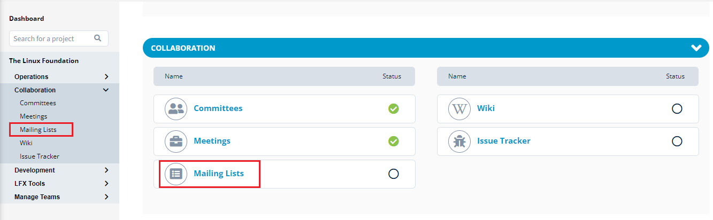

# PCC Dashboard

PCC has a dashboard that provides you with the list of projects that are available in The Linux Foundation. You can see your affiliated projects under **MY PROJECTS** tab. You can also view all the project details in **All PROJECTS** tab.

This dashboard provides details such as:

* Project name
* Logo
* Number of sub projects in the main project
* Details of the sub project
* Stage or the status of the project

The following icons are available on the dashboard:

| **Icons**                                  | **Description**        |
| ------------------------------------------ | ---------------------- |
| **Operations**                             | \*\*\*\*               |
| .png>)       | Project Definition     |
| .png>)      | Membership             |
|              | Cloud Providers        |
|       | Domains                |
|             | Legal                  |
|                                            |                        |
| **Collaborations**                         | \*\*\*\*               |
|             | Committee              |
|             | Meetings               |
|              | Mailing List           |
|             | Wiki                   |
|              | Issue Tracker          |
|                                            |                        |
| **Development**                            | \*\*\*\*               |
|              | Source Control         |
|              | Continuous Integration |
| .png>)      | Distribution           |
|                                            |                        |
| **LFX Tools**                              | \*\*\*\*               |
|             | Insights               |
| .png>)      | Security               |
|             | EasyCLA                |
| .png>)   | Crowdfunding           |
| .png>)   | Mentorship             |
|                                            |                        |
| **General Icons**                          | \*\*\*\*               |
| .png>)   | Progress Bar           |
|      | Running                |
| .png>)   | Warning                |
| .png>) | Disabled               |

To access PCC dashboard and its services, you need to login into [PCC](http://projectadmin.lfx.linuxfoundation.org) using your LF SSO account. As you login into the PCC, the Dashboard appears.


The **Show archived projects** toggle button allows you to show or hide the archived projects from the list.


## My Projects 

MY PROJECTS tab provides you the list of projects which are affiliated with you or your organization.


If you do not see the projects that you manage, you can create a support ticket.


To create a support ticket, perform the following steps:

1.Click **Get Help** and select **Support**.

2.You will be navigated to the LFX Support page. You have to enter the relevant details and click **Create** to submit your support request.

## All Projects

All Projects lists all the projects that are created irrespective of who has created them.

## Search Functionality

You can search for the required project using the search tabs available on right top of the dashboard as well as on the left menu bar.

.png>)
