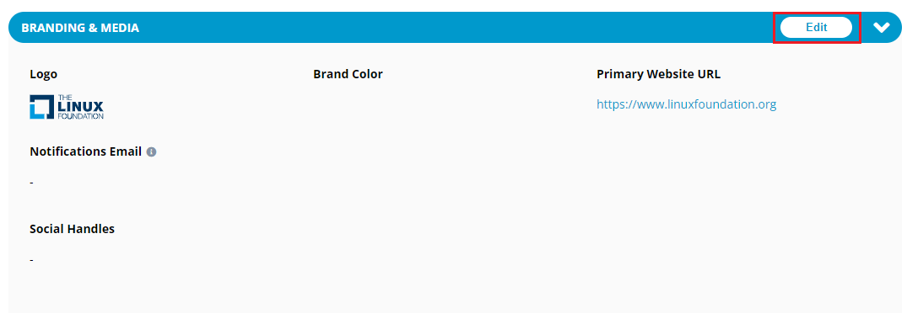

# Project Definition for a Project

Project Definition for a project allows you to view information related:

* [Basic](basic-setup-for-a-project.md#basic-information)
* [Branding](basic-setup-for-a-project.md#branding-information) and Media &#x20;
* [Personnel](basic-setup-for-a-project.md#personnel-information)
* Artifacts&#x20;

## Basic Information 

You can update basic information related to the project such as common name of the project, stage of the project, slug name.

To update basic information for a project, perform the following steps:

1.Login into PCC.

2\. Search for the required project. The Project dashboard appears. Click **Project Definition** from the **Operations** tab.


You can also navigate to Project Definitions from the Vertical Sidebar navigation menu. Click **Operations** and then select **Project Definition**.


<figure><figcaption>
Project Defination
</figcaption></figure>

3.The Basic page appears. Click **Edit** available in the Basic tab.

4.The Edit Basic dialog box appears. Update the following details and click **Save**.

| **Field**              | **Action**                                                                                                                                                                                                                |
| ---------------------- | ------------------------------------------------------------------------------------------------------------------------------------------------------------------------------------------------------------------------- |
| **Common Name**        | You can update the common name that you have provided at the time of creating the project.                                                                                                                                |
| **Category**           | Category can be updated only when you have selected a parent project at the time of creating the project.                                                                                                                 |
| **Slug**               |                                                                                                                                                                                                                           |
| **Stage**              | Select the appropriate stage of the project. By default, the stage is selected to Prospect when you create a new project.                                                                                                 |
| **Announcement Date**  | Select the date when the project will be released.                                                                                                                                                                        |
| **Technology Sector**  | 
Select an appropriate technology sector for your project. You can also select more than one sector.

If you feel that your project falls across all sectors, check the <strong>Cross Technology</strong> box.
 |
| **Industry Sector**    | 
Select an appropriate industry sector for your project. You can also select more than one sector.

If you feel that your project falls across all sectors, check the <strong>Cross-Industry</strong> box.
     |
| **Technical Activity** | Select an appropriate technical activity for your project. You can also select more than one sector.                                                                                                                      |
| **Funding**            | Select funding type for your project. If you select the funding type as **Funded**, then the **Model** field becomes mandatory.                                                                                           |
| **Model**              | Select an appropriate model for your project. This field becomes mandatory when the funding type of your project is **Funded**.                                                                                           |
| **CII Project ID**     | Enter the CII Project ID.                                                                                                                                                                                                 |
| **Description**        | Provide a short description for your project.                                                                                                                                                                             |

## Branding Information

You can also provide details related to branding of the project like uploading the logo for the project, providing brand color and website details.

To update branding information for a project, perform the following steps:

1.Click on the required project and click **Project Definition** .

<figure><figcaption>
Project Definition
</figcaption></figure>

2\. Click **Edit** from the Branding and Media section to update branding details.

<figure><figcaption>
Branding and Media
</figcaption></figure>

3.The Basic dialog box appears. Click **Branding**, update the following details and click **Save**:

## Personnel Information 

Basic setup also allows you to update personnel information like executive name, owner details, and program manager details.

To update personnel information for a project, perform the following steps:

1.Click on the required project and click **Project Definition** .

<figure><figcaption>
Project Definition
</figcaption></figure>

2\. Click **Edit** from the Personnel section to update personnel details.

<figure><figcaption>
Personnel Edit
</figcaption></figure>

3.The Basic dialog box appears. Click **Personnel**, update the following details and click **Save**:

