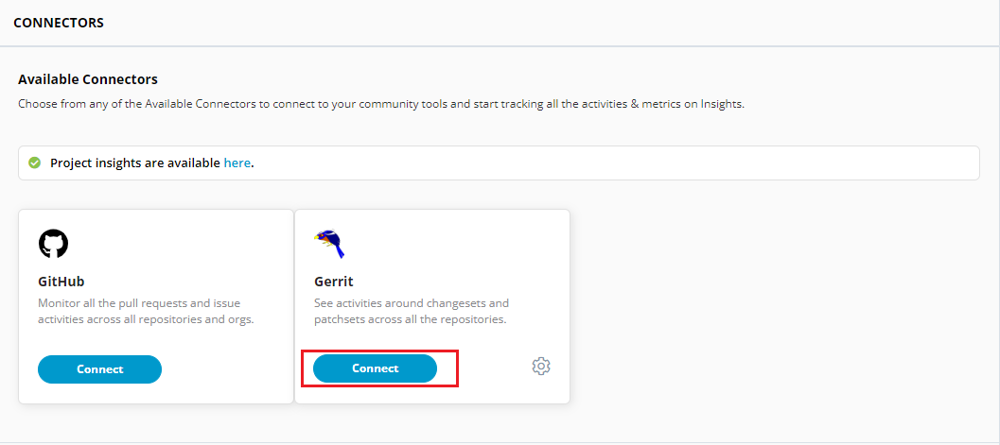
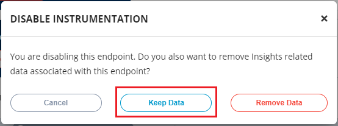
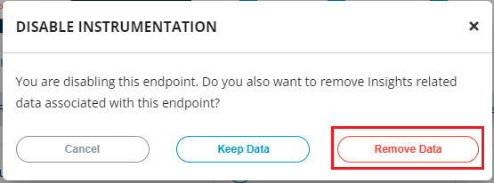

# Connecting Gerrit

Connecting Gerrit connectors will help the Insights to collect and analyze various parameters related to the open source projects.&#x20;

To connect Gerrit connector for Insights, perform the following:

1.Login to PCC.

2.Click **Insights** available under under **LFX Tools** menu.


You can also navigate to Insights from the Vertical Sidebar navigation menu. Click **LFX Tools** and then select **Insights**.


<figure><figcaption>
Insights
</figcaption></figure>

3.The Connectors screen appears with list of available data connectors. Click **Connect** from the Gerrit tile.&#x20;


You should have added the Gerrit server in the Source Control. If the Gerrit Server is not added in the Source Control, you cannot connect it for the Insights connectors.&#x20;

For more information refer [Gerrit Source Control](https://docs.linuxfoundation.org/lfx/project-control-center/it-services-for-a-project/source-control#setting-up-gerrit).&#x20;


<figure><figcaption>
Gerrit 
</figcaption></figure>

4.The Gerrit Server is connected and you can see the Gerrit server details along wit the repositories associated with it.&#x20;

&#x20;

<figure><figcaption>
Gerrit and Repositories 
</figcaption></figure>


If the Gerrit server or its repositories is not detected, you need to file a ticket with the support team.&#x20;


<figure><figcaption>
Support Ticket 
</figcaption></figure>

## Connection Status for Gerrit&#x20;

There are different connection status that are available for the Gerrit organizations:

<table><thead><tr><th width="214">Connection Status </th><th>Icon</th></tr></thead><tbody><tr><td>Full Connection </td><td></td></tr><tr><td>No Connection </td><td></td></tr><tr><td>Failed Connection </td><td></td></tr></tbody></table>

<figure><figcaption>
Status 
</figcaption></figure>

## Adding Tags&#x20;

Tags will allows you to group bunch of repositories. This will allow you to  have aggregated data of each tag on Insights.

To add tags, preform the following steps:

1 Click the  icon listed next to the repository.&#x20;

<figure><figcaption>
Tags
</figcaption></figure>

2\. The Add Tags dialog box appears. Select the tag name and click **Add** and select **Save**.

<figure><figcaption>
Add Tags
</figcaption></figure>

## Disabling Instrumentation for Gerrit Account

You can disable the instrumentation for the Gerrit account as per your requirement. You can enable or disable the account to suit your needs. Disabling an account does not remove the complete account information, it only puts the account in disabled mode.

To disable Gerrit account, perform the following:

1.Use Toggle button available under Instrument.

<figure><figcaption>
Instrumentation 
</figcaption></figure>

2.The Disable Instrumentation dialog box appears. Click **Keep Data** to disable Gerrit account.


**Remove Data** will delete the account permanently. &#x20;


<figure><figcaption>
Keep Data
</figcaption></figure>

## Deleting Gerrit Account

You can delete the connected Gerrit account permanently. Deleting a Gerrit  account will remove all the configured data.

To delete the Gerrit account, perform the following

1.User Toggle button. The Disable Instrumentation dialog box appears. Click **Remove Data** to delete Gerrit account.

<figure><figcaption>
Remove Account 
</figcaption></figure>
