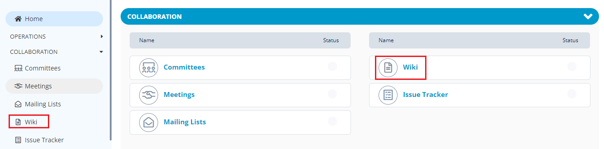
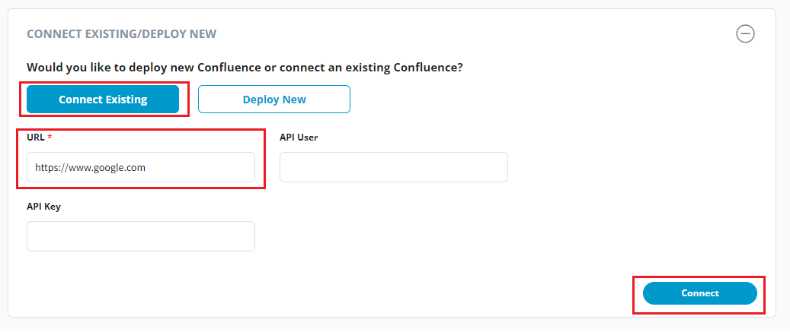

# Setting up Wiki

You can setup a knowledge base and documentation for your project using Confluence. The team can use this documentation repository to create articles and documentation knowledge bases related to the project.

PCC supports the following documentation tool:

* Confluence

## Confluence Setup for a Project 

PCC allows you to setup a Confluence repository for your project to create documentation related to your project.

To setup Confluence for your project, perform the following:

1.Login into PCC.

2\. Search for the required project. The Project dashboard appears. Click **Wiki** from the **Collaboration** tab.


You can also navigate to Wiki from the Vertical Sidebar navigation menu. Click **Collaboration** and then select **Wiki**.


<figure><figcaption>
Wiki
</figcaption></figure>

3.You have two options to setup a Confluence page:

* Connect to existing
* Deploy New

a) If you want to connect to the existing server, Click **Connect Existing**. Enter **URL** of the existing server and click **Connect**. The Confluence page will be setup to the existing server.


You should have setup the Primary Domain to the project, before you connect to the existing Confluence page.&#x20;


<figure><figcaption>
Existing Server 
</figcaption></figure>

b) If you want to connect to a new server, select **Deploy New** and click **Deploy**. The Confluence page will be setup to a new service provider.

<figure><figcaption>
New Server
</figcaption></figure>
