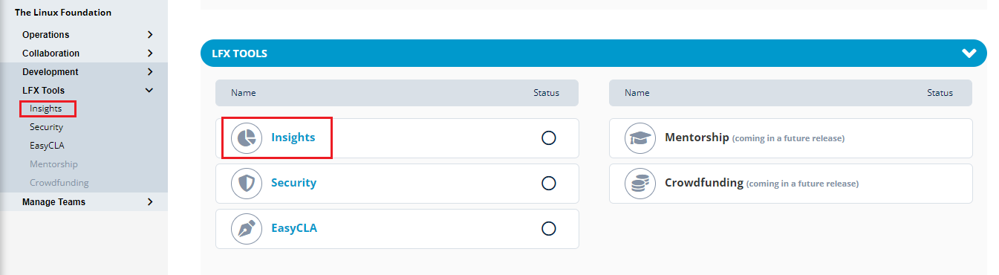

# Insights

Insights gives you complete visibility into project performance and ecosystem trends. It helps to understand your contributor community and make informed decisions with our analytics and reporting tools.

For more information on Insights, refer to [Insights ](https://lfx.linuxfoundation.org/tools/insights). For more information on Insights documentation, refer to [Insights Documentation](https://docs.linuxfoundation.org/lfx/insights).

PCC allows you to onboard Insights through GitHub data connectors.&#x20;


You should have the necessary permission to onboard Insights data connectors from PCC.

You must have Project Administrator or Project Maintainer permissions to onboarding Insights data connectors in PCC.

A user from a particular project may be named as Project Maintainer. But, a user with Project Maintainer title will not have project maintainer permissions until they are granted with the project maintainer permissions.&#x20;


## Upcoming Data Connectors&#x20;

* Bugzilla
* CircleCI
* Discord&#x20;
* DockerHub
* Earned Media
* Gerrit
* Git
* Gitlab
* Google Groups
* Groups.io
* Jira
* Jenkins
* Linkedin
* Pipermail
* Rocket.chat
* Twitter
* Slack
* Wiki

## Accessing Insights from PCC

To access Insights from PCC, perform the following:

1.Login into PCC.

2.Click **Insights** available under **LFX Tools** dropdown menu.

<figure><figcaption>
Insights
</figcaption></figure>
