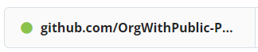
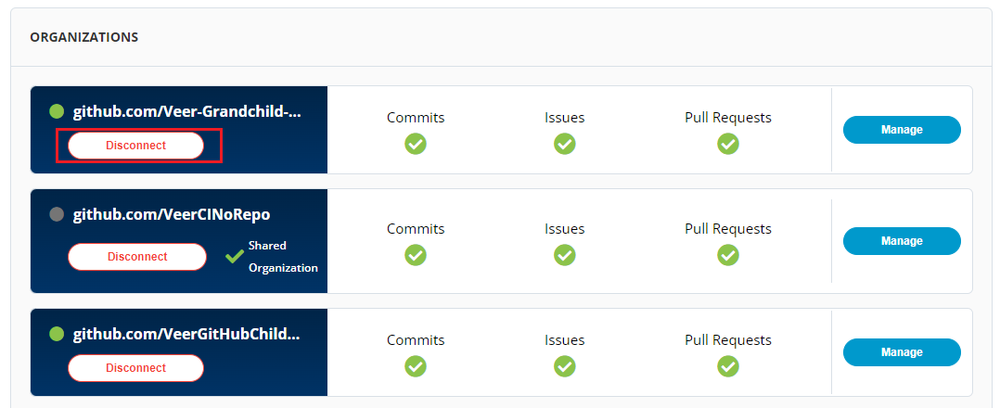
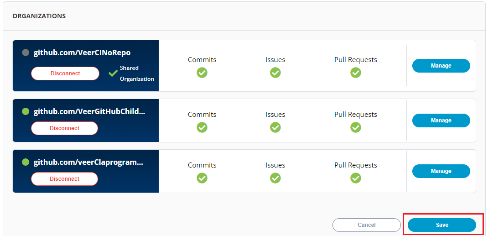
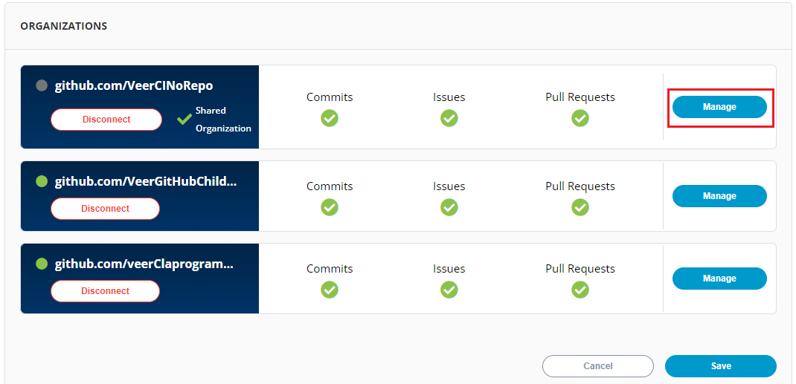
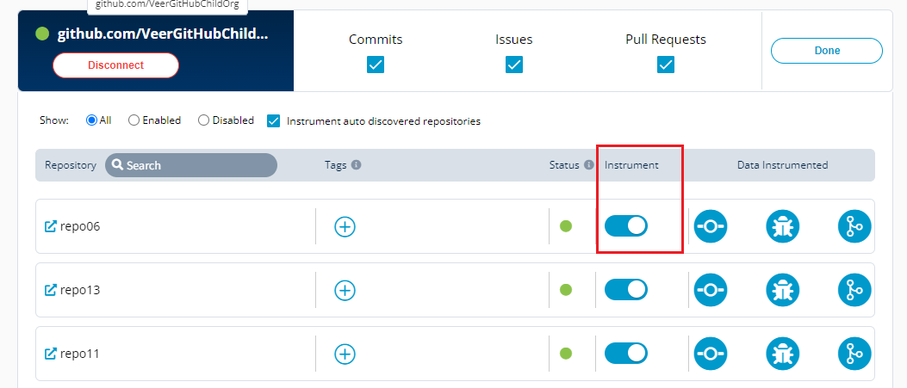

# Connecting GitHub

Connecting GitHub connectors will help the Insights to collect and analyze various parameters related to the open source projects.&#x20;

To connect GitHub connector for Insights, perform the following:

1.Login to PCC.

2.Click **Insights** available under **LFX Tools** menu.


You can also navigate to Insights from the Vertical Sidebar navigation menu. Click **LFX Tools** and then select **Insights**.


<figure><figcaption>
Insights
</figcaption></figure>

3.The Connectors screen appears with list of available data connectors. Click the  icon listed next to Connect GitHub Organization tab.&#x20;


Project Administrator can connect to a new organization. Project Maintainer can enable or disable instrumentation on repos, or enable an existing ("autodetected") org, but they cannot connect a new org.


<figure><figcaption>
Connect 
</figcaption></figure>

4\. If you want to add a new organization apart from the auto detected organizations, enter the organization name in the **Organization** field under Additional Organization and click **Connect**&#x20;


If you have already set up your GitHub orgs or repositories in PCC, they will automatically be detected and available for your project in the **Auto Detected Organizations**. You can click **Connect** to connect to the auto detected GitHub organizations.&#x20;

You can connect Organization that has **Full Connection** status. Refer [Connection Status](https://docs.linuxfoundation.org/lfx/project-control-center-pre-release/tools/insights/connecting-github#connection-status-for-github-organization) for more information.&#x20;


<figure><figcaption></figcaption></figure>

6.The connected GitHub account is listed under Configure Account, click **Save** to complete the GitHub connection.


Once the project is onboarded, it might take up to 48 hours for the project to show up on LFX insights.

The green dot under Instrumentation Status indicates that the GitHub account is enabled.


<figure><figcaption>
Save
</figcaption></figure>

## Connection Status for GitHub Organization&#x20;

There are different connection status that are available for the GitHub organizations:

<table><thead><tr><th width="214">Connection Status </th><th>Icon</th><th>Description </th></tr></thead><tbody><tr><td>Full Connection </td><td></td><td> thelinuxfoundation user is added to the organization. </td></tr><tr><td>Partial Connection </td><td></td><td>thelinuxfoundation user is added to the organization but not an owner of the organization.</td></tr><tr><td>No Connection </td><td></td><td>thelinuxfoundation user is not added to the organization.</td></tr><tr><td>Organization Not Found </td><td></td><td>The organization does not exist.</td></tr></tbody></table>

## Disconnecting GitHub Account&#x20;

You can disconnect a GitHub account as and when you desire to disconnect it.&#x20;

To disconnect a connected GitHub account, perform the following steps:

1.Click Disconnect for the organization that you want to disconnect.&#x20;

<figure><figcaption>
Disconnect 
</figcaption></figure>

2.The Disconnect GitHub Organization dialog box appears. Click Disconnect.&#x20;

<figure><figcaption>
Disconnect 
</figcaption></figure>

3.Click **Save** to apply the changes.&#x20;

<figure><figcaption>
Save
</figcaption></figure>

## Disabling Instrumentation for GitHub Account

You can disable the instrumentation for the GitHub account as per your requirement. You can enable or disable the account to suit your needs. Disabling an account does not remove the complete account information, it only puts the account in disabled mode.

To disable GitHub account, perform the following:

1.Click **Manage**.&#x20;

<figure><figcaption>
Manage
</figcaption></figure>

2.Use Toggle button available under Instrument.

<figure><figcaption>
Instrument 
</figcaption></figure>

3.The Disable Instrumentation dialog box appears. Click **Keep Data** to disable GitHub account.


**Remove Data** will delete the account permanently. &#x20;


<figure><figcaption>
Keep Data
</figcaption></figure>

## Deleting GitHub Account

You can delete the connected GitHub account permanently. Deleting a GitHub account will remove all the configured data.

To delete the GitHub account, perform the following:

1.Click the delete  icon available under Manage tab. The Disconnect GitHub URL appears, click **Disconnect**.

OR

2.User Toggle button. The Disable Instrumentation dialog box appears. Click **Remove Data** to delete GitHub account.

<figure><figcaption>
Remove Account 
</figcaption></figure>
