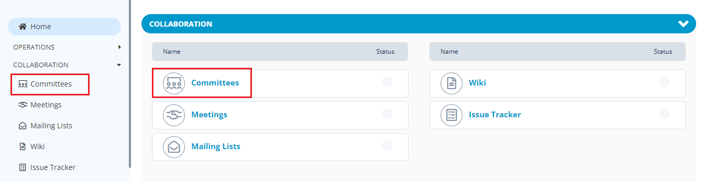
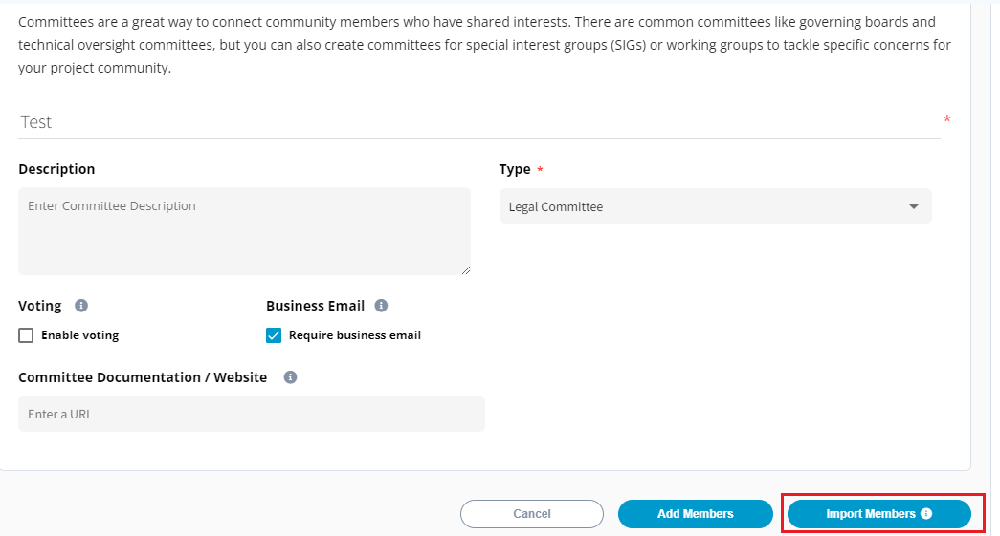
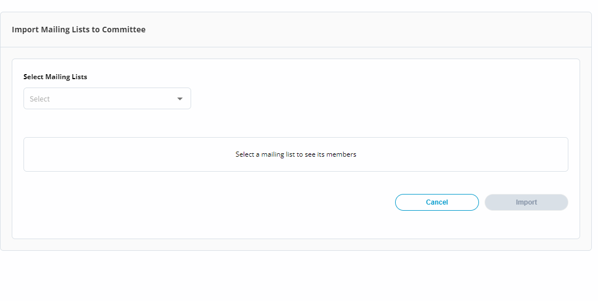
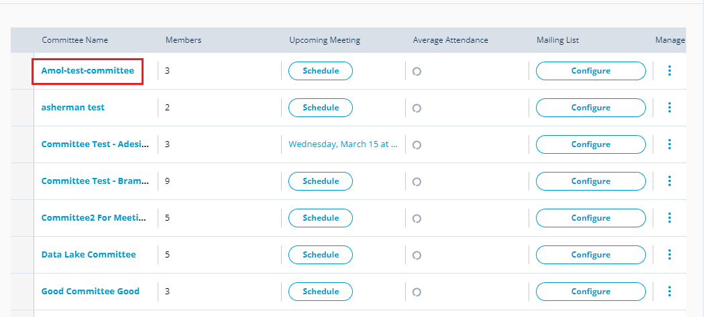
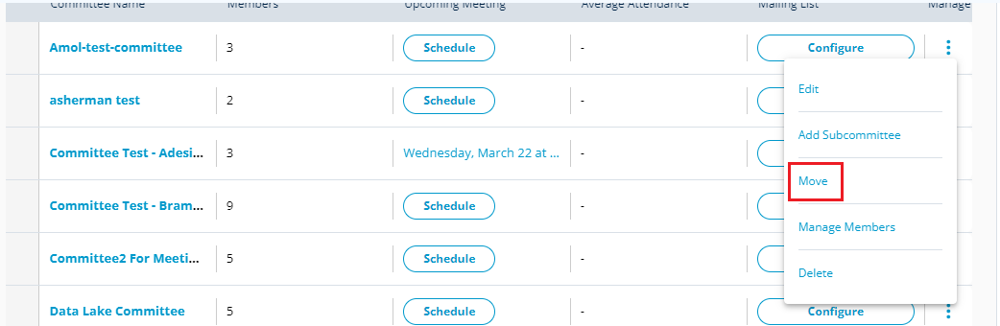
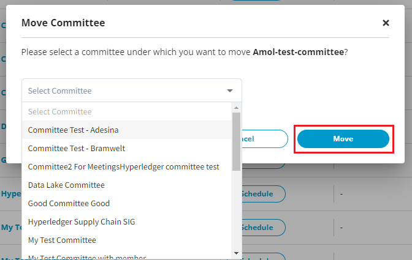

# Committees Setup for a Project

Committee setup of project allows you to provide information on:

* [Committee Overview](committees-setup-for-a-project.md#committee-overview)
* [Committee](committees-setup-for-a-project.md#billing-information)
* [Adding Members](committees-setup-for-a-project.md#adding-member-to-a-committee)
* [Deleting a Committee](committees-setup-for-a-project.md#deleting-a-committee)
* [Deleting a Member from a Committee](committees-setup-for-a-project.md#deleting-a-member-from-a-committee)
* [Manage Meetings](committees-setup-for-a-project.md#managing-meetings)
* [Manage Mailing List](committees-setup-for-a-project.md#managing-mailing-list)

## Committee Overview

The Committee overview section provides the overview information on:

* Total number of committee meetings&#x20;
* Total number of meeting attendees&#x20;
* Percentage average meeting attendance of the committee members
* Total number of participant invited to the upcoming meetings.

<figure><figcaption>
Committee Overview 
</figcaption></figure>

## Add a Committee 

You can add and update committee information related to the project such as name, mailing list, committee website, permissions and description.

To add a committee for a project, perform the following steps:

1.Click on the required project and click **Committees** from the **Collaborations** tab.


You can also navigate to Committees from the Vertical Sidebar navigation menu. Click **Collaborations** and then select **Committees**.


<figure><figcaption>
Committees
</figcaption></figure>

2.The Committee page appears. Click **+Add Committee** to add the committee details.

<figure><figcaption>
Add Committee
</figcaption></figure>

3.The Create Committee page appears. Update the following details and click **Next** and click **Save** to create a committee.

| **Field**                       | **Action**                                                                                                                        |
| ------------------------------- | --------------------------------------------------------------------------------------------------------------------------------- |
| Add Committee Name              | Enter the name of the committee                                                                                                   |
| Description                     | Provide the description on the committee                                                                                          |
| Type                            | Select the type of committee that you want to create                                                                              |
| Enable Voting                   | Toggle the Enable Voting to enable the voting for the committee                                                                   |
| Committee Documentation/Website | Enter the committee website URL of the committee which can provide the committee details such as policies, meetings and schedules |


If you want to update the existing committee details, click the edit .png>) icon.

If you want to delete the existing committee, click the delete .png>)icon.


### Import Members into a Committee&#x20;

You have an option to import members from the mailing list into the committee.&#x20;

To import members into the committee, perform the following steps:

1.Click **+Add Committee** to add the committee.

2.The Create Committee page. Enter the Committee Name, Select the committee Type and Click **Import Members**.&#x20;

<figure><figcaption>
Import Members
</figcaption></figure>

3.The Import Mailing Lists to Committee dialog box appears. Select the required Mailing Lists from the **Select Mailing Lists** drop down and click **Import**. All the members belonging to the selected mailing list are imported to the committee.&#x20;

<figure><figcaption>
Import Members
</figcaption></figure>

### Adding Members to a Committee

After you setup the committee, you can add members to that committee who can exercise various responsibilities that are assigned to the members.

To add a member to a committee, perform the following steps:

1.Click on the required project and click **Committees**.

2.The Committees page appears with the list of committees that are created for the project. Click the required committee where you want to add the members.

<figure><figcaption>
Committees List
</figcaption></figure>

3.The selected committee page appears with list of members. Click **+ Add Member**. &#x20;

<figure><figcaption>
Add Member
</figcaption></figure>

4.The Add Committee Member dialog box appears. You can search for the member by providing their name or email.&#x20;

<figure><figcaption>
Search Member
</figcaption></figure>

5.If you are unable to add a member by providing their email ID or  name. You can add them by clicking **Fill Out profile** link. The Add Committee Member dialog box appears. Update the following details and click **Save**:

<figure><figcaption></figcaption></figure>

| **Field**         | **Action**                              |
| ----------------- | --------------------------------------- |
| Name              | Enter the name of the member            |
| Email ID          | Enter the email ID of the member        |
| Company           | Enter the name of the company           |
| Job Title         | Enter the title for the member          |
| Appointed By      | Select the required appointed by        |
| Voting Status     | Select the required voting status       |
| Voting Start Date | Select the voting start date            |
| Voting End Date   | Select the voting end date              |
| Role              | Select the required role for the member |
| Role Start Date   | Select the role start date              |
| Role End Date     | Select the role end date                |


After adding a first member to a committee, if you want to add another member to a committee, you need to click the Committee and then click **Add Member** to add additional members to the committee.



* If a member has a verified LFID,  icon is displayed.&#x20;
* If a member LFID is pending for verification,  icon is displayed.
* If a member does not have a LFID,  icon is displayed.&#x20;


<figure><figcaption>
Member LFID Status 
</figcaption></figure>

## Send a Message&#x20;

You can send a message through mail to the member.&#x20;

To send a message to a member, perform the following steps:

1.Click on the required project and click **Committees**.

2.You can see the list of committees that are created for the project. Click the committee from which you want to remove or delete a member from a committee.

3.The Committee page appears with list of members in it. Click the click  icon and select **Send Message**.&#x20;

<figure><figcaption>
Send a Message
</figcaption></figure>

4.Compose the mail and send it to the member.&#x20;

## Mailing to Members

You can share mail to all the members of the committee at once.&#x20;

To share mail to all the member of the committee, perform the following steps:

1.Click on the required project and click **Committees**.

2.You can see the list of committees that are created for the project. Click the committee from which you want to remove or delete a member from a committee.

3.The Committee page appears with list of members in it. Click **Email Members**.&#x20;

<figure><figcaption>
Email Members
</figcaption></figure>

4.The Email Committee dialog box appears. Click **Compose Email** to draft mail and share it with the all the members of the committee.&#x20;

<figure><figcaption>
Email Committee 
</figcaption></figure>

## Deleting a Member from a Committee

You can delete a member from a committee as and when required.

To delete a member, perform the following steps:

1.Click on the required project and click **Committees**.

2.You can see the list of committees that are created for the project. Click the committee from which you want to remove or delete a member from a committee.

3.The Committee page appears with list of members in it. Click Click the click  icon and select **Delete**.&#x20;

<figure><figcaption>
Delete
</figcaption></figure>

4.The Delete Committee Member dialog box appears. Click **Delete** to remove a member from the committee.

<figure><figcaption>
Delete Member
</figcaption></figure>

## Managing Committees&#x20;

Manage committees allows you to edit, add subcommittee, move, manage members and delete the committee.&#x20;

### Updating the Committee

You can update or modify the committee.&#x20;

To update the committee, perform the following steps:

1.Under Manage, click the  and select **Edit**.&#x20;

<figure><figcaption>
Edit
</figcaption></figure>

2.The Manage Committee dialog box appears. Update the committee as per your requirements and click **Save**.&#x20;

<figure><figcaption>
Manage Committee
</figcaption></figure>

### Adding a Sub Committee&#x20;

You can also add a sub committee under a committee.&#x20;

To add a sub committee, perform the following steps:

1.Under Manage, click the  and select **Add Subcommittee**.

&#x20;

<figure><figcaption>
Add Subcommittee
</figcaption></figure>

2.The Add Sub Committee page appears. Enter the details as required and click **Next**.&#x20;

<figure><figcaption>
Sub Committee
</figcaption></figure>

3.You can also add members to the sub committee. Click Save to save the sub committee.&#x20;

<figure><figcaption>
Save
</figcaption></figure>

### Moving a Committee into another Committee

You can move a committee under an exisitng committe.&#x20;

To move a committee, perform  the following steps:

1.Under Manage, click the  and select **Move**.

<figure><figcaption>
Move
</figcaption></figure>

2.The Move Committee dialog box appears. Select the committee under which you want to move the committee and click **Move**.&#x20;

<figure><figcaption>
Move Committee
</figcaption></figure>

### Deleting a Committee

You can delete a committee if you want to. Deleting a committee will also remove all the members added in the committee.

To delete a committee, perform the following steps:

1.Under Manage, click the  and select **Delete**.

<figure><figcaption>
Delete
</figcaption></figure>

2\. The Delete Committee confirmation dialog box appears. Click **Delete** to delete the committee. A confirmation toast message appears informing that the committee has been deleted

<figure><figcaption>
Confirm Delete
</figcaption></figure>

## Managing Meetings

Meetings related to committees are listed in the committees list under **Upcoming Meetings** tab. You can see the scheduled meetings and as well as schedule a meeting. On click of **Schedule**, the page navigates to Meeting Management to schedule a meeting.

## Managing Mailing List

You can configure mailing list for your committees. On click of **Configure** available under **Mailing List**, the page navigates to **Mailing List**.

