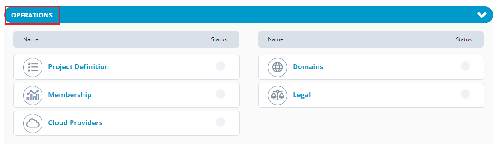

# Operations for a Project

When you add a new project, you need to setup the project with some basic and generic services to administer the project in an effective way. The following are the Operations  services for your project that are offered by Linux Foundation:

* [Project Definition](https://docs.linuxfoundation.org/lfx/project-control-center/setup-services-for-a-project/basic-setup-for-a-project)
* [Domains](https://docs.linuxfoundation.org/lfx/project-control-center/setup-services-for-a-project/setting-up-a-domain-for-a-project)
* [Cloud Providers](https://docs.linuxfoundation.org/lfx/project-control-center/setup-services-for-a-project/cloud-providers)&#x20;
* [Legal](https://docs.linuxfoundation.org/lfx/project-control-center-pre-release/setup-services-for-a-project/legal-setup-for-a-project)
* [Membership](https://docs.linuxfoundation.org/lfx/project-control-center-pre-release/setup-services-for-a-project/membership-setup-for-a-project)

<figure><figcaption>
Operations 
</figcaption></figure>

The following graphic provides a brief information on various operations services and its uses:

