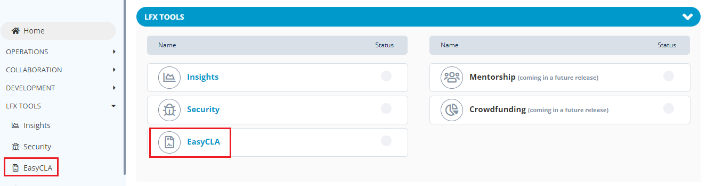

# EasyCLA

​[​](https://circleci.com/gh/communitybridge/easycla)EasyCLA streamlines the management and execution of Contributor License Agreements (CLAs), to help projects ensure that contributions are made in accordance with project policies. It is the only CLA management tool to correctly support both individual and corporate CLA workflows in an automated environment.

To setup the EasyCLA service using PCC:

1.Login into PCC.

2\. Search for the required project. On Project dashboard , click **CLA** under the **LFX Tools** tab.


You can also navigate to EasyCLA from the Vertical Sidebar navigation menu. Click **LFX Tools** and then select **EasyCLA**.


<figure><figcaption>
EasyCLA
</figcaption></figure>

3.For detailed information on how to setup the CLA, see [CLA Setup](https://docs.linuxfoundation.org/lfx/easycla/v2-current/project-managers/create-new-cla-group).

​
