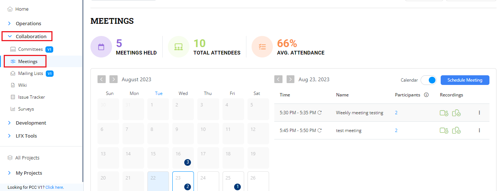
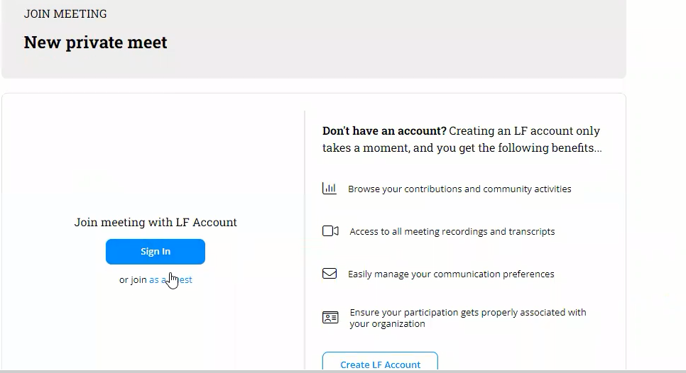

# Meetings

PCC allows you to setup and manage meetings. You can schedule recurring and non recurring meetings among the teams. Meeting Management also allows you to view past meeting recordings, transcript copies of the meetings and also provides the option to share the recording with other team members. PCC also provides a wizard that provides you high level details related to the meetings.

## Meeting Management Wizard

The Meeting Management widget provides you the following details:

* Total number of past meetings to date
* Total number of participants or attendees in the meeting
* Average attendance of the meeting

<figure><figcaption>
Meeting Management Wizard
</figcaption></figure>

## Meetings

You can view the meetings either in **List View** or in **Calendar View**. List view provides list of meetings that are scheduled and the Calendar view shows the scheduled meetings in a calendar.

<figure><figcaption>
Meeting View
</figcaption></figure>

### Scheduling a Meeting

Meeting Management allows you to schedule a recurring or a non recurring meetings. You can schedule a meeting and add participants belonging to various committees. You can also invite a private induvial who does not belong to any community.

To schedule a recurring meeting, perform the following:

1.Login into PCC.

2.Search for the required project. The Project dashboard appears. Click **Meetings** from the **Collaboration** tab.

<figure><figcaption>
Meetings
</figcaption></figure>

3.Click **+Schedule Meeting**.

<figure><figcaption>
Schedule Meeting
</figcaption></figure>

4.The Schedule Meeting page appears. Update the following details and click **Schedule Meeting** to complete the meeting schedule.

| Field                               | Action                                                                                                                                                                                                                                                                                                                                                                                                                                                                                                                                                                                                                                                                                                                                                                                                                                  |
| ----------------------------------- | --------------------------------------------------------------------------------------------------------------------------------------------------------------------------------------------------------------------------------------------------------------------------------------------------------------------------------------------------------------------------------------------------------------------------------------------------------------------------------------------------------------------------------------------------------------------------------------------------------------------------------------------------------------------------------------------------------------------------------------------------------------------------------------------------------------------------------------- |
| Add Title                           | Enter the name of meeting                                                                                                                                                                                                                                                                                                                                                                                                                                                                                                                                                                                                                                                                                                                                                                                                               |
| Meeting Details                     | Select the date and time for the meeting to be scheduled                                                                                                                                                                                                                                                                                                                                                                                                                                                                                                                                                                                                                                                                                                                                                                                |
| Frequency of the meeting            | 
Select the required frequency of the meeting.  <em><strong>Note</strong></em>: If you are scheduling a <strong>non recurring meeting</strong>, you need to select <strong>Does Not Repeat</strong>.
                                                                                                                                                                                                                                                                                                                                                                                                                                                                                                                                                                                                                        |
| Meeting Settings Meeting Visibility | <ul><li><strong>Make Meeting Public</strong> - By default, all meetings will be private. If you want to make the meeting public, you need to select the <strong>Make Meeting Public</strong>.</li><li><strong>Restricted</strong> - You can select this option to restrict the meetings to the invited participants only. </li><li>
<strong>Record Meeting</strong> - Select this meeting to record a meeting. 
<ul><li><strong>None</strong>- Meeting recording will be shared only with the PCC access only. </li><li><strong>Meeting Attendees</strong> - Meeting recording will be shared with the attendees who have attended the meeting.  </li></ul></li><li><strong>Transcribe Meeting</strong> - Select the transcript visibility. You can either set the visibility of the transcription as Private or Public.</li></ul> |
| Meeting Description                 | Provide the description on the meeting                                                                                                                                                                                                                                                                                                                                                                                                                                                                                                                                                                                                                                                                                                                                                                                                  |
| Select a Committee                  | Select the required committee for which the you want to invite the committee for the meeting.                                                                                                                                                                                                                                                                                                                                                                                                                                                                                                                                                                                                                                                                                                                                           |
| Select Voting Status                | 
Select the voting status that you want to assign to a committee. You can select the following status:
<ul><li>Alternative Voting Rep</li><li>Observer </li><li>Voting Rep</li></ul>                                                                                                                                                                                                                                                                                                                                                                                                                                                                                                                                                                                                                                               |
| Invite Guests                       | You can invite guests to the meeting by providing the name or email ID of the guest by entering the details in the **Add Guests** search field.                                                                                                                                                                                                                                                                                                                                                                                                                                                                                                                                                                                                                                                                                         |
| Select Mailing List                 | Select the required committee that you want to invite for the meeting.                                                                                                                                                                                                                                                                                                                                                                                                                                                                                                                                                                                                                                                                                                                                                                  |


* You can also invite a member who does not belong to the committee. Click **+ Add New Invite**. Enter the details such as name, company , email ID and job title of the participant and click **Add Meeting Participant**.
* You can also add yourself to the meeting by clicking the **+ Add yourself to the meeting**. You can remove the participant by click of delete  icon.
* If you are scheduling a **non recurring meeting**, you need to select **Does Not Repeat** while updating the frequency of the meeting.
* A recurring meeting is indicated with icon.&#x20;


<figure><figcaption>
Schedule Meeting 
</figcaption></figure>


In the Meeting list, **Host Key** will be a blank field until the time is one hour or less from the start of the meeting. When the meeting is less than than one hour from the scheduled time, the host key will appear in the **Host Key** row for the given meeting and the user can see/copy the value to add it into the Zoom to claim the host. This Host Key is only valid for the next occurrence of the meeting.


<figure><figcaption>
Host Key
</figcaption></figure>


When the meeting is within one hour of the scheduled time, the Host Key appears as a masked key. You can click the   icon to see the host copy and click the  icon to copy the host key.&#x20;


## Meeting Settings

Following are few pointers related to Meeting Settings:

* When you are scheduling a meeting which is a **Public meeting** and where the **Restricted** settings is disabled, then the user can login by providing their name and email is optional.&#x20;

<figure><figcaption>
Public Meeting
</figcaption></figure>

* When you are scheduling a meeting which is a **Private meeting** and where the **Restricted** settings is enabled, then the participant can login by providing their name and email ID that has been added during the scheduling of the meeting. Participant cannot login with guest credentials, they have to mandatorily use the email.&#x20;

<figure><figcaption>
Committee with Board 
</figcaption></figure>

## Past Meetings

You can view the past meetings by selecting the date or month for which you want to view past scheduled meetings. The list provides details such as meeting title, meeting date, number of attendees, recording and transcript of the meeting.


You can share the recording and transcript of the meeting with the required members.&#x20;


<figure><figcaption>
Past Meetings
</figcaption></figure>

## Flexible Scheduling of a Meeting&#x20;

PCC provides the flexibility to update the scheduled meetings. Flexible scheduling allows the administrators to modify the meeting based on the requirements that change on day to day basis.  Flexible scheduling allows you to:

* Update the time of any single occurrence of a recurring meeting series. For example, you can prepone or postpone the meeting for a particular date of a recurring meeting. You can only update the time for single occurrence and not the complete series of meetings.&#x20;
* Cancel the meeting of a single occurrence of a recurring meeting. For example, you can cancel the meeting for a single occurrence of a particular day of a recurring meeting. If there is any holiday, you can cancel the meeting for that day.&#x20;
* Change or cancel a single event which arises due to attendee conflicts and holidays.
* Add or remove a participant for a particular occurrence of a recurring meeting.&#x20;


**Manage Meetings** and **Delete Meeting** options provides you with the option of flexible meetings.&#x20;


### Manage Meetings

Manage Meetings allows you to update the scheduled meetings. It allows you to update the meeting title, time, frequency of the meeting, and other update for a scheduled meeting.

Manage Meetings also allows you to manage participants. You can resend the invite to the participants, add new participants, and remove a participant from the meeting.&#x20;

To manage meeting, perform the following steps:

1.Select the scheduled meeting that you want to update, click  icon and select **Manage Meeting**.&#x20;

<figure><figcaption>
Manage Meeting
</figcaption></figure>

2.The Manage Recurring Meeting dialog box appears. You can either update the changes to only the current occurrence meeting or to all the occurrences and select the **Continue**.&#x20;

<figure><figcaption>
Manage Recurring Meeting 
</figcaption></figure>

3.The Mange Meeting screen appears. Update the necessary changes and click **Save** to update the modified information.&#x20;

#### Resend the Invite

To resend the meeting invite again to a participant, perform the following steps:

1.Select the scheduled meeting, click the  icon and select **Manage Meetings**.

<figure><figcaption>
Manage Meetings
</figcaption></figure>

2.The Manage Recurring Meeting dialog box appears. You can either update the changes to only the current occurrence meeting or to all the occurrences and select the **Continue**.&#x20;

<figure><figcaption>
Manage Recurring Meeting 
</figcaption></figure>

3.Click the  icon for the required participant and select **Resend Invite**. A flyer message appears that informs that the invite has been successfully sent to the selected participant.&#x20;

<figure><figcaption>
Resend Invite
</figcaption></figure>

#### Remove Participant&#x20;

You can remove the participant from the meeting.&#x20;

To remove the participant, perform the following steps:

1.Select the scheduled meeting that you want to update, click  icon and select **Manage Meeting**.&#x20;

<figure><figcaption>
Manage Meeting
</figcaption></figure>

2.The Manage Recurring Meeting dialog box appears. You can either update the changes to only the current occurrence meeting or to all the occurrences and select the **Continue**.&#x20;

<figure><figcaption>
Manage Recurring Meeting 
</figcaption></figure>

3.Click the  icon and select **Remove Participant** to remove the participant. &#x20;

<figure><figcaption>
Remove Participant 
</figcaption></figure>

### Share Meeting&#x20;

You can share the public meeting link with the various participants who can get registered to the shared meeting.&#x20;

To share a public meeting, perform the following steps:

1.Select the scheduled public meeting that you want to share, click  icon and select **Share Meeting**.&#x20;

<figure><figcaption>
Share Meeting
</figcaption></figure>

2.The Share Meeting pop message appears. Click **Copy** to copy the meeting link.

<figure><figcaption>
Meeting Link  
</figcaption></figure>

### Clone Meetings&#x20;

You can clone a particular meeting and update the clone meeting as per your requirements. Clone meeting allows to retain the meeting of a particular meeting and make the changes to it.&#x20;

To clone a meeting, perform the following steps:

1.Select the scheduled public meeting that you want to clone, click  icon and select **Clone Meeting**.&#x20;

<figure><figcaption>
Clone Meeting
</figcaption></figure>

2.The Clone Meeting page appears with the meeting details of the meeting that is selected to clone. You can make the changes as per your requirement and click **Save** to schedule the cloned meeting.&#x20;

<figure><figcaption>
Clone Meeting
</figcaption></figure>

### Delete Meetings

You can delete the scheduled meetings. You also has an option either to delete a particular occurrence or the all the occurrence of the recurring meeting. &#x20;

To delete a meeting,  perform the following steps:

1.Select the scheduled meeting that you want to delete, click  icon and select **Delete Meeting**.&#x20;

<figure><figcaption>
Delete Meeting
</figcaption></figure>

2.The Delete Recurring Meeting dialog box appears. You can either select:&#x20;

* **Delete this occurrence only** or&#x20;
* **Delete this occurrence and all the future occurrences in this series.**&#x20;

Click **Delete** after selecting the required option.&#x20;

<figure><figcaption>
Delete Meeting Options
</figcaption></figure>
