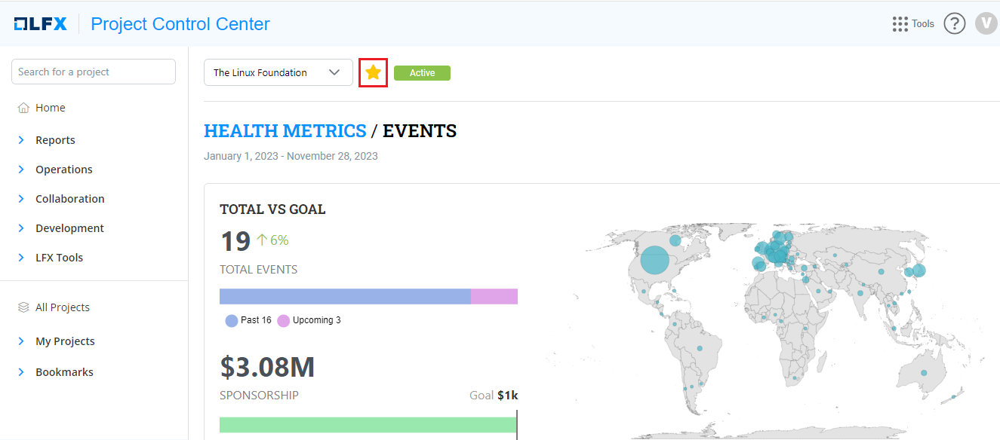
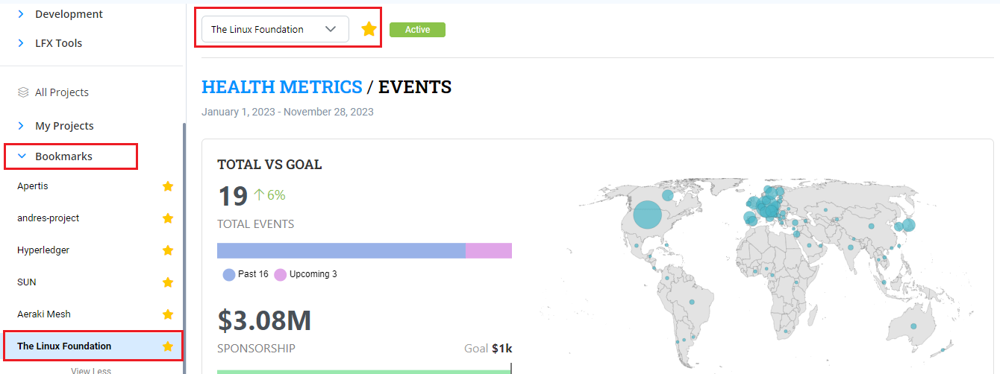

# Bookmarks

Bookmarks allows you to bookmark any of your favorite project. Bookmarking a project allows you to view all your favorite projects under one tab. Bookmarking allows you to mark a particular project as your favorite project by  just click of a star button. &#x20;

To bookmark a project, perform the following steps:

1.Go to the project that you want to bookmark and click the  icon available next to the project name.&#x20;

<figure><figcaption>
Bookmark
</figcaption></figure>

2.The project will be bookmarked and available under the **Bookmarks** tab.&#x20;

<figure><figcaption>
Bookmark Tab
</figcaption></figure>

