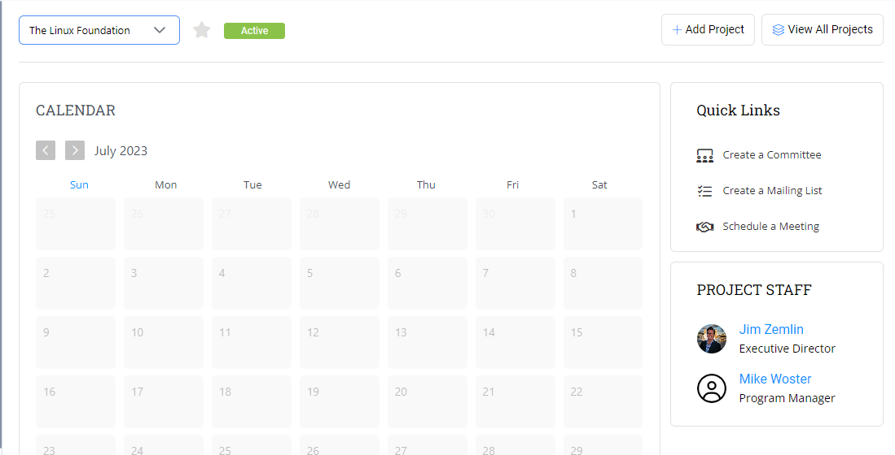
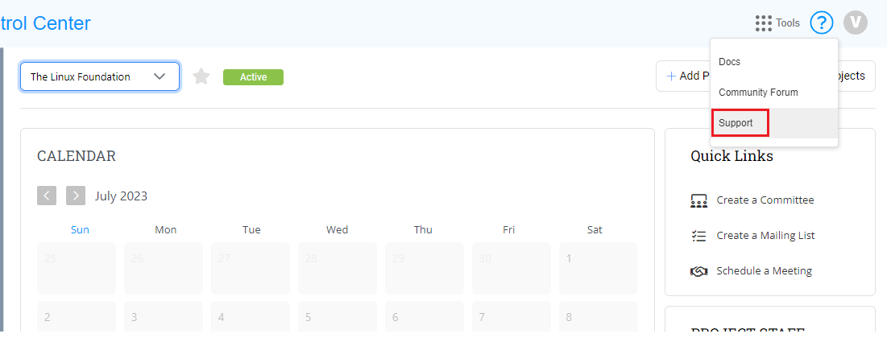
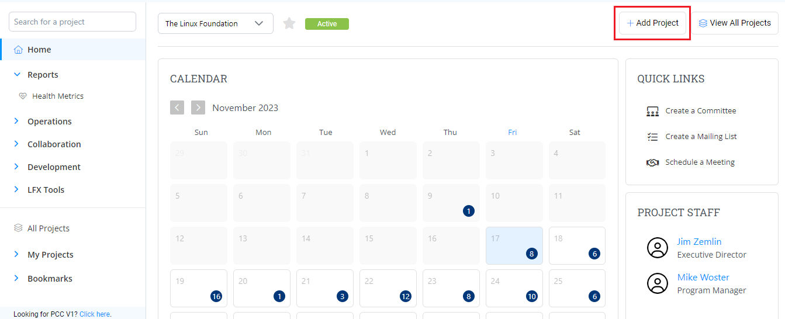
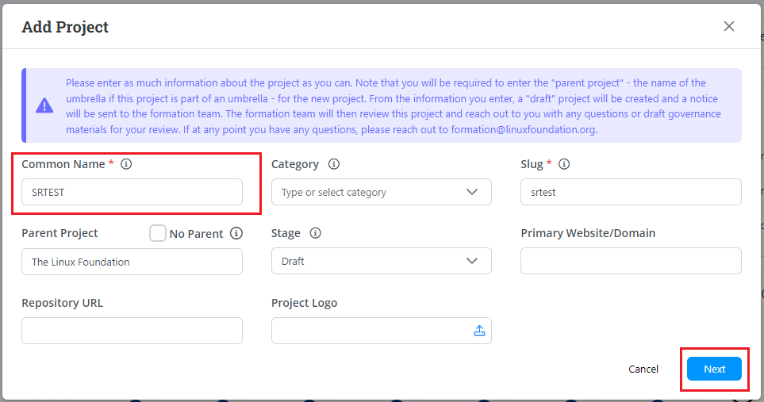
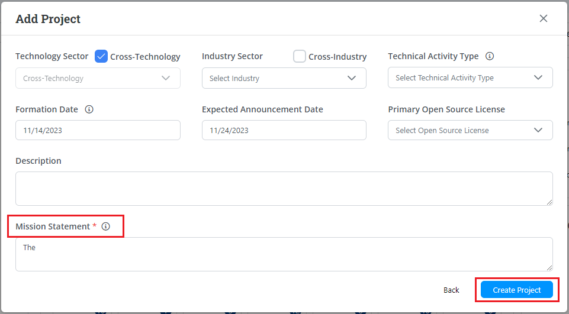
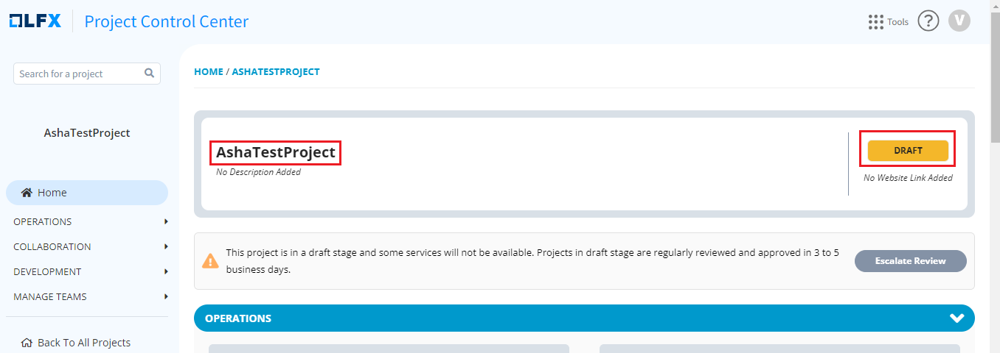
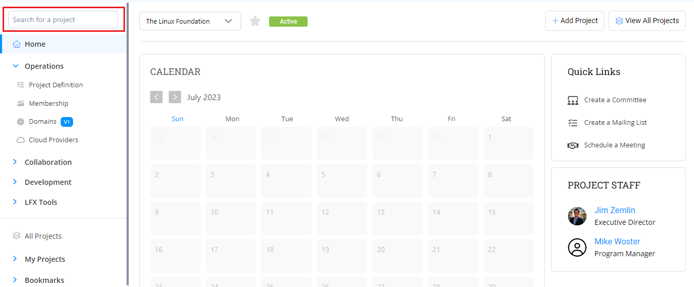
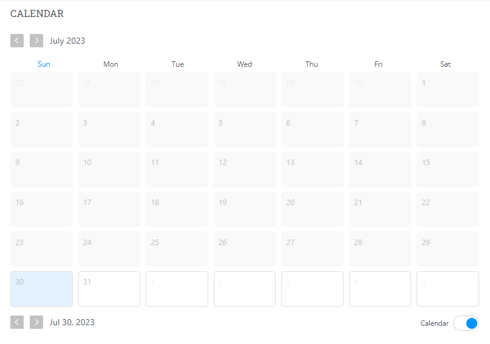

# PCC Dashboard

PCC has a dashboard that provides you with the list of projects that are available in The Linux Foundation.&#x20;

This dashboard provides details such as:

* Project name
* Stage or the status of the project
* Add a project button to add a new project
* View all projects button to view all the projects available in the platform
* A calendar that displays all the scheduled meetings&#x20;
* A quick link to create:
  * To create a committee
  * To create a mailing list&#x20;
  * To schedule a meeting&#x20;
* Project staff details such has Executive Director and Program Manager

<figure><figcaption>
Dashboard
</figcaption></figure>

To access PCC dashboard and its services, you need to login into [PCC](http://projectadmin.lfx.linuxfoundation.org) using your LF SSO account. As you login into the PCC, the Dashboard appears.

## Create Support Ticket 

You can create a support ticket if you are having issues with any of your projects. support ticket.

To create a support ticket, perform the following steps:

1.Click the **help**  icon  and select **Support**.

<figure><figcaption>
Support
</figcaption></figure>

2.You will be navigated to the LFX Support page. You have to enter the relevant details and click **Create** to submit your support request.

## Add a Project

You can host your project in the Linux Foundation. Once the company decides to host its project on the Linux Foundation, you (administrator) needs to create a project for every new company that hosts their projects or foundation on Linux Foundation using PCC.&#x20;

1.Login into PCC.


If you do not have access to PCC, you need to raise the service ticket to get access to PCC. Refer [PCC Overview](https://docs.linuxfoundation.org/lfx/project-control-center-pre-release/overview).



As a administrator, you need to create the projects and sub projects as per the needs of the company.


2.The PCC dashboard appears. Click **+Add Project**.

<figure><figcaption>
Add Project
</figcaption></figure>

3.The Add Project dialog box appears. Update the following details and click **Next**.

| **Field**                  | **Action**                                                                                                                                                              |
| -------------------------- | ----------------------------------------------------------------------------------------------------------------------------------------------------------------------- |
| **Common Name**            | 
Enter the name of the project that you identify the project name with.  This is a mandatory field. 
                                                        |
| **Category**               | Category will be enabled only when you select a Parent Project. You can select the project to categorize for better grouping and navigation.                            |
| **Slug**                   | Slug will be auto added when you provide the common name. You can also edit it if you need.                                                                             |
| **Parent Project**         | 
Select the parent project if you want to associate or add your project as a child project.

Select No Parent, if you do not want to add any parent project.
 |
| **Stage**                  | Select the appropriate stage of the project. By default, the stage is selected to Prospect when you create a new project.                                               |
| **Primary Website/Domain** | Enter the primary website or domain of the project.                                                                                                                     |
| **Repository URL**         | Enter the GitHub repository url.                                                                                                                                        |
| **Project Logo**           | You can upload the relevant logo for your project.                                                                                                                      |

<figure><figcaption>
Add Project
</figcaption></figure>

4.The Add Project dialog box with additional fields appears. Update the following details and click **Create Project**.

| **Field**                       | **Action**                                                                                                                                                                                                                |
| ------------------------------- | ------------------------------------------------------------------------------------------------------------------------------------------------------------------------------------------------------------------------- |
| **Technology Sector**           | 
Select an appropriate technology sector for your project. You can also select more than one sector.

If you feel that your project falls across all sectors, check the <strong>Cross Technology</strong> box.
 |
| **Industry Sector**             | 
Select an appropriate industry sector for your project. You can also select more than one sector.

If you feel that your project falls across all sectors, check the <strong>Cross-Industry</strong> box.
     |
| **Technical Activity Type**     | Select an appropriate technical activity for your project. You can also select more than one sector.                                                                                                                      |
| **Formation Date**              | Select the formation date of the project.                                                                                                                                                                                 |
| **Expected Announcement Date**  | Select the date when the project will be expected to be released.                                                                                                                                                         |
| **Primary Open Source License** | Select the required primary open source license for your project.                                                                                                                                                         |
| **Description**                 | Provide a short description for your project.                                                                                                                                                                             |
| **Mission Statement**           | 
Provide a single line mission statement that depicts your project followed by primary goal of your project.   This is a mandatory field. 
                                                                    |

<figure><figcaption>
Create Project
</figcaption></figure>

4.A success message is displayed when a project is created successfully. You can see the newly added project under My Projects tab.


For a new project, by default the project status is set to **Draft**. You can change the status in the Basic setup service.


<figure><figcaption>
New Project 
</figcaption></figure>

​

## View All Projects

View All Projects lists all the projects that are created irrespective of who has created them.

<figure><figcaption>
View All Projects 
</figcaption></figure>

## Search Functionality

You can search for the required project using the search tabs available on right top of the dashboard as well as on the left menu bar.

<figure><figcaption>
Search
</figcaption></figure>

## Calendar View

Calendar view will provide you with a calendar view which displays all the meetings that are scheduled under your project.&#x20;


You can use the toggle button if you want to enable or disable the calendar view for your project&#x20;


<figure><figcaption>
Calendar
</figcaption></figure>

## Quick Links&#x20;

You can see a Quick Link list that provides you with an option to create few quick tasks related to committee, mailing list and meetings. These links allows you to quickly accomplish the tasks without accessing these modules from the side bar menu.&#x20;

Quick Links assist you in creating the following tasks:

* Create a committee, for more information refer [create a committee](https://docs.linuxfoundation.org/lfx/project-control-center/it-services-for-a-project/committees-setup-for-a-project#billing-information)
* Create a mailing list, for more information refer [create a mailing list](https://docs.linuxfoundation.org/lfx/project-control-center/it-services-for-a-project/mailing-list)
* Schedule a meeting, for more information refer [schedule a meeting](https://docs.linuxfoundation.org/lfx/project-control-center/it-services-for-a-project/meetings#scheduling-a-meeting)

<figure><figcaption>
Quick Links 
</figcaption></figure>

## Adding Project Staff&#x20;

You can add the project staff details such as executive director and program manager.&#x20;

To update the project staff, perform the following:

1.Click on the required project staff.&#x20;

2.The Edit Project Staff dialog box appears. Update the project staff details and click **Confirm**.&#x20;

<figure><figcaption>
Project Staff
</figcaption></figure>
