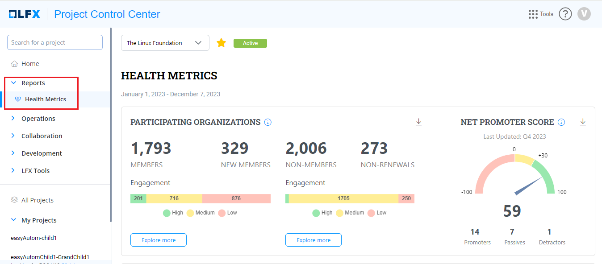

# Health Metrics

Health Metrics provides you with a dashboard for all onboarded projects that shows a quick snapshot of the project health by combining metrics from the [OSSF Scorecard](https://github.com/ossf/scorecard) project and the [CNCF CLOMonitor](https://github.com/cncf/clomonitor) project to compute an overall best practices score to the projects.&#x20;

The main aim of this feature it to provide visibility to the projects on areas to improve as per the OSS best practices guidelines for project setup and also keep a check on the health and take immediate actions when the same starts deteriorating. This dashboard will also act as a checklist of sorts for the projects when they are ready to Graduate.

## Accessing Health Metrics&#x20;

To access Health Metrics report, perfrom the following steps:

1.Login into PCC.

2\. Search for the required project. Click **Reports** and then select **Health Metrics**.&#x20;

<figure><figcaption>
Health Metrics 
</figcaption></figure>
